# BasesDatos — UD2: ERD (Prácticas!)

> @mermaid.js.org: [Entity Relationship Diagrams](https://mermaid.js.org/syntax/entityRelationshipDiagram.html) &ensp; - &ensp; @mermaid.js.org: [Flowcharts - Basic Syntax](https://mermaid.js.org/syntax/flowchart.html)
> 
> @LucidChart: [Entity-Relationship Diagram Symbols and Notation](https://www.lucidchart.com/pages/ER-diagram-symbols-and-meaning)
>
> @AlvaroMonge: [Design pattern: subclasses - Top down design](https://web.csulb.edu/colleges/coe/cecs/dbdesign/dbdesign.php?page=subclass.php)

---

1. Para la base de datos de una clínica veterinaria, modelizar la entidad **animal**, con al menos 3 atributos (los que se os ocurran), indicando cuál podría ser la clave primaria.   Para la base de datos de un equipo de fútbol, modelizar la entidad **jugador**, con al menos 3 atributos (los que se os ocurran), indicando cuál podría ser la clave primaria.

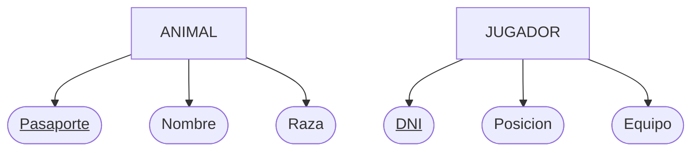
```mermaid
flowchart TD;
    Animal[ANIMAL]
        Animal --> Pasaporte([<u>Pasaporte</u>])
        Animal --> Nombre([Nombre])
        Animal --> Raza([Raza])
    Jugador[JUGADOR]
        Jugador --> DNI([<u>DNI</u>])
        Jugador --> Posicion([Posicion])
        Jugador --> Equipo([Equipo])
```

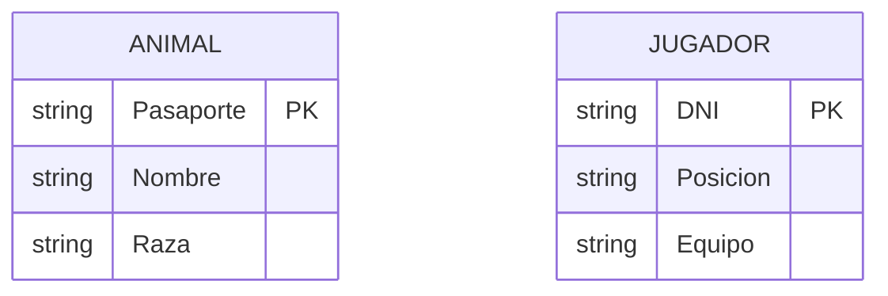
```mermaid
erDiagram
    ANIMAL {
        string Pasaporte PK
        string Nombre
        string Raza
    }
        JUGADOR {
        string DNI PK
        string Posicion
        string Equipo
    }
```

---

2. En una base de datos de una agencia de viajes, necesitamos guardar información sobre los turistas y sobre los hoteles, sabiendo que un turista puede viajar a muchos hoteles y un hotel puede albergar a muchos turistas. Representa esta información en un diagrama entidad-relación, indicando la participación mínima y máxima de cada entidad, y la cardinalidad de la relación.

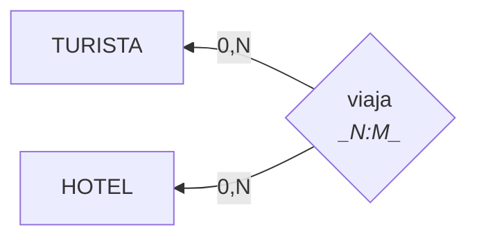
```mermaid
graph RL;
    Viaja{viaja<br><i>_N:M_</i>} --> |0,N| Turista[TURISTA]
    Viaja --> |0,N| Hotel[HOTEL] 
```

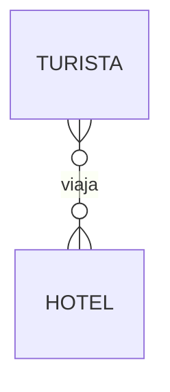
```mermaid
erDiagram
    TURISTA O{--O{ HOTEL : viaja
%% N:M
```

---

3. Modelizar la entidad **REY**, con sus correspondientes relaciones, participaciones y cardinalidades, sabiendo que:
   - Un rey reina sólo en un país, y en un país reina sólo un rey.
   - Un rey es hijo de otro rey.
 - NOTA: Una misma entidad puede tener más de una relación con otras entidades (por ejemplo, PERSONA *compra* CASA y PERSONA *trabaja* en OFICINA), e incluso puede tener varias relaciones distintas con una misma entidad. Por ejemplo, la entidad PROFESOR y la entidad DEPARTAMENTO, podrían estar unidas mediante una relación "*pertenece*" y otra relación "*coordina*", las cuales tendrían distinta cardinalidad como hemos visto en la sesión.

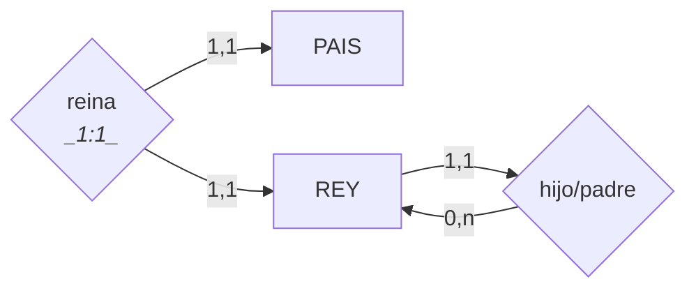
```mermaid
flowchart LR;
    reina{reina<br><i>_1:1_</i>} --> |1,1|Pais[PAIS]
    reina --> |1,1| Rey[REY] --> |1,1| hp{hijo/padre<br>} --> |0,n| Rey
```

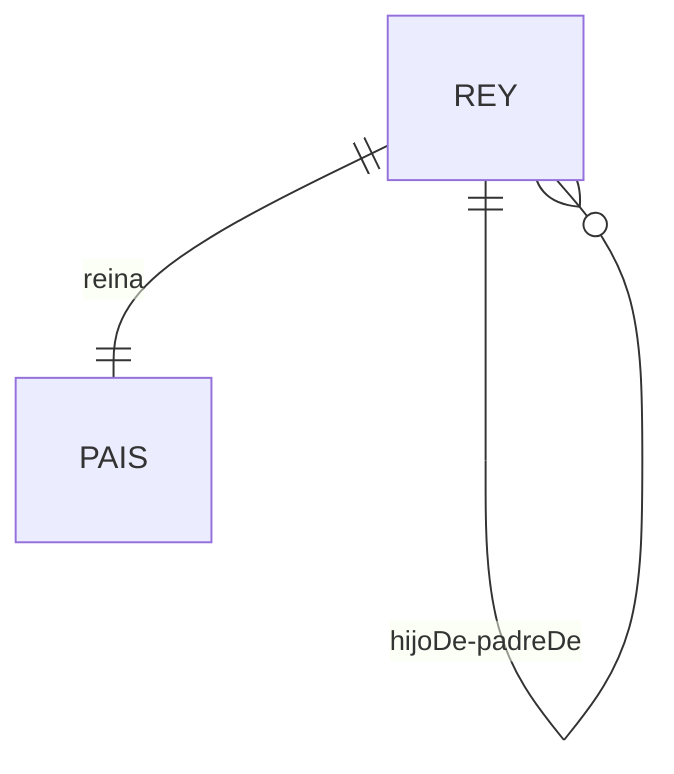
```mermaid
erDiagram
    REY ||--|| PAIS : reina
    REY ||--O{ REY : hijoDe-padreDe
```

---

4. Se desea modelizar la siguiente situación de una cadena de tiendas de ropa:
   - En una tienda se venden diferentes prendas de ropa (pantalones, faldas, camisas, chaquetas, etc.). Cada prenda puede venderse en una o más tiendas.
   - De cada tienda nos interesa guardar el nombre, la dirección y el número de empleados que trabajan en ella.
   - De cada prenda deseamos conocer el tipo (pantalón, falda, camisa...), la talla, el color y el precio. También guardaremos un código, único para cada prenda.
 - Elabora el diagrama Entidad-Relación que refleje toda la información, y calcula la participación de cada entidad y la cardinalidad de la/s relacción/es.

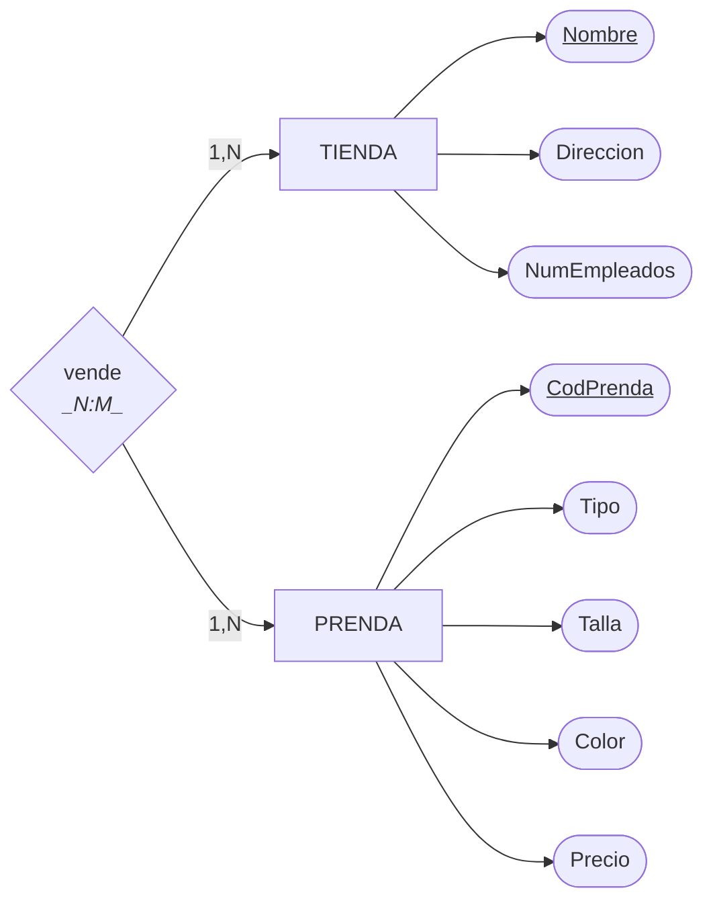
```mermaid
flowchart LR;
    vende{vende<br><i>_N:M_</i>} --> |1,N| TIENDA[TIENDA]
        TIENDA --> nombre([<u>Nombre</u>])
        TIENDA --> direccion([Direccion])
        TIENDA --> numEmpleados([NumEmpleados])
    vende --> |1,N| PRENDA[PRENDA]
        PRENDA --> codigo([<u>CodPrenda</u>])
        PRENDA --> tipo([Tipo])
        PRENDA --> talla([Talla])
        PRENDA --> color([Color])
        PRENDA --> precio([Precio])
```

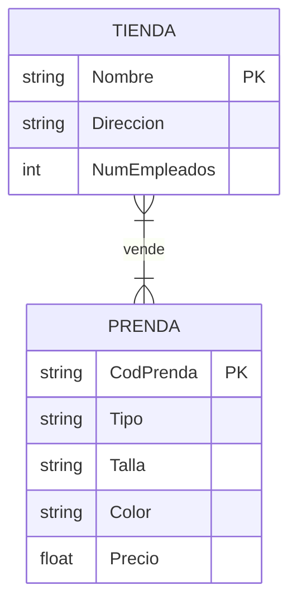
```mermaid
erDiagram
    TIENDA |{--|{ PRENDA : vende
    TIENDA {
        string Nombre PK
        string Direccion
        int NumEmpleados
    }
    PRENDA {
        string CodPrenda PK
        string Tipo
        string Talla
        string Color
        float Precio
    }
```

---

5. Se desea modelizar la siguiente información sobre las instalaciones de ITEP:
   - Se desea conocer información de sus centros: dirección, localidad, número de plantas, número de aulas y metros cuadrados totales.
   - También se desea almacenar el tamaño de cada aula, si dispone de ventilación y el equipamiento que tiene. Cada aula tiene también un número que la identifica, único en cada centro.
 - Elabora el diagrama Entidad-Relación que refleje toda la información, y calcula la participación de cada entidad y la cardinalidad de la/s relacción/es.

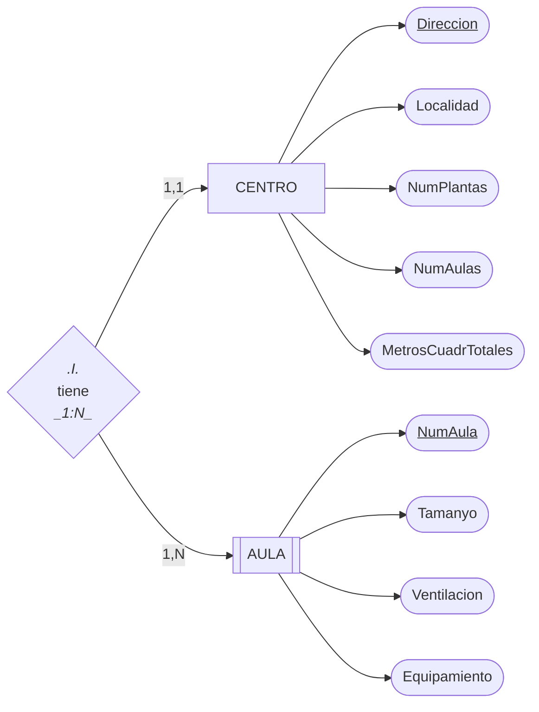
```mermaid
flowchart LR;
    tiene{<i>.I.</i><br>tiene<br><i>_1:N_</i>} --> |1,1| CENTRO[CENTRO]
        CENTRO --> Direccion([<u>Direccion</u>])
        CENTRO --> Localidad([Localidad])
        CENTRO --> NumPlantas([NumPlantas])
        CENTRO --> NumAulas([NumAulas])
        CENTRO --> MTC([MetrosCuadrTotales])
    tiene --> |1,N| AULA[[AULA]]
        AULA --> NumAula([<u>NumAula</u>])
        AULA --> Tamanyo([Tamanyo])
        AULA --> Ventilacion([Ventilacion])
        AULA --> Equipamiento([Equipamiento])
```

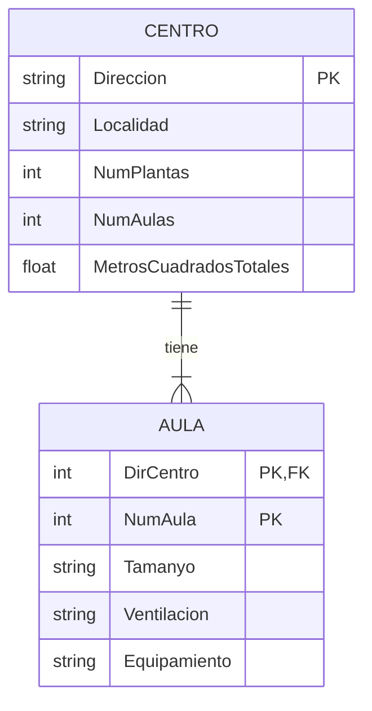
```mermaid
erDiagram
    CENTRO ||--|{ AULA : tiene
    CENTRO {
        string Direccion PK
        string Localidad
        int NumPlantas
        int NumAulas
        float MetrosCuadradosTotales
    }
    AULA {
        int DirCentro PK, FK
        int NumAula PK
        string Tamanyo
        string Ventilacion
        string Equipamiento
    }
```

--- 

6. Diseñar un esquema E/R que recoja la organización de un sistema de información en el que se quieren tener los datos sobre municipios, viviendas y personas, teniendo en cuenta que:
    - De los municipios nos interesa conocer el Nombre, código postal y provincia a la que pertenecen.
    - De las personas necesitamos almacenar la fecha de nacimiento.
    - De las viviendas queremos conocer su dirección y su tipo (piso, chalet, duplex...).
    - Cada persona sólo puede vivir en una vivienda, pero puede ser propietaria de varias.
    - Puede haber viviendas que no se hayan vendido aún, o que, estando vendidas, aún no estén habitadas.
    - En cada vivienda hay una de las personas que es cabeza de familia. Una misma persona sólo puede ser cabeza de familia en una vivienda.

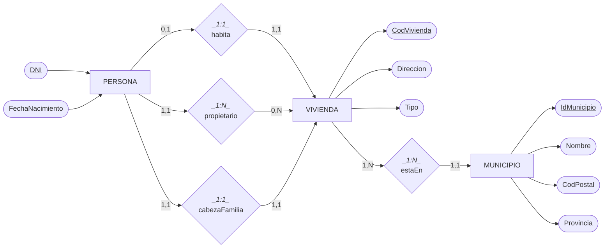
```mermaid
flowchart LR;

PERSONA[PERSONA]
    DNI([<u>DNI</u>]) --> PERSONA
    FechaNac([FechaNacimiento]) --> PERSONA

PERSONA --> |0,1| habita{<i>_1:1_</i><br>habita} --> |1,1| VIVIENDA
PERSONA --> |1,1| propietario{<i>_1:N_</i><br>propietario} --> |0,N| VIVIENDA
PERSONA --> |1,1| cabezaFamilia{<i>_1:1_</i><br>cabezaFamilia} --> |1,1| VIVIENDA

VIVIENDA[VIVIENDA]
    VIVIENDA --> CodVivienda([<u>CodVivienda</u>])
    VIVIENDA --> Direccion([Direccion])
    VIVIENDA --> Tipo([Tipo])

MUNICIPIO[MUNICIPIO]
    MUNICIPIO --> IdMunicipio([<u>IdMunicipio</u>])
    MUNICIPIO --> Nombre([Nombre])
    MUNICIPIO --> CodPostal([CodPostal])
    MUNICIPIO --> Provincia([Provincia])

VIVIENDA --> |1,N| estaEn{<i>_1:N_</i><br>estaEn} --> |1,1| MUNICIPIO
```

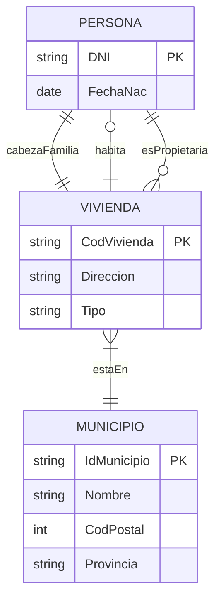
```mermaid
erDiagram
    PERSONA ||--|| VIVIENDA : cabezaFamilia
        PERSONA {
            string DNI PK
            date FechaNac
        }
    PERSONA O|--|| VIVIENDA : habita
    PERSONA ||--O{ VIVIENDA : esPropietaria
        VIVIENDA {
            string CodVivienda PK
            string Direccion
            string Tipo   
        }
    VIVIENDA |{--|| MUNICIPIO :estaEn
        MUNICIPIO {
            string IdMunicipio PK
            string Nombre
            int CodPostal
            string Provincia
        }
```

---

7. En la base de datos de la cadena de tiendas de ropa nos piden almacenar algo más de información sobre algunos tipos de prendas:
   - De los pantalones necesitamos conocer el ancho y el largo.
   - De las prendas de abrigo, queremos saber de qué temporada son (invierno o entretiempo) y el tipo de relleno que tienen.

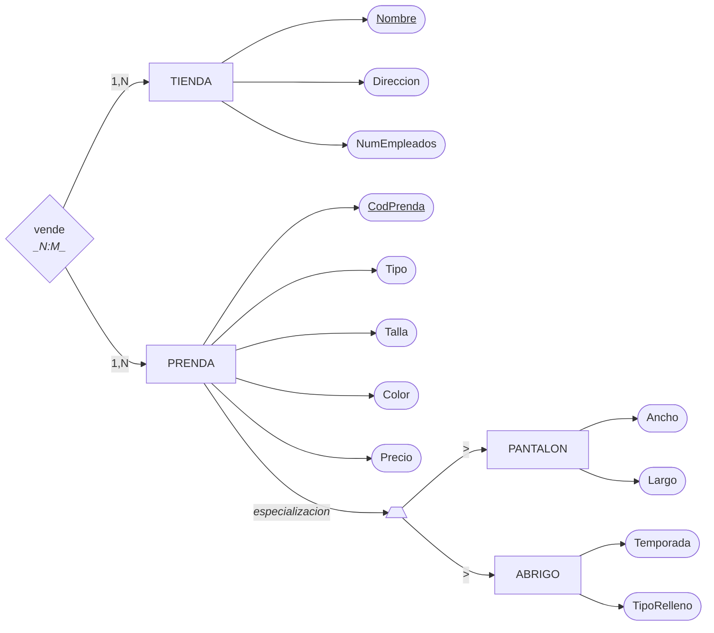
```mermaid
flowchart LR;
    vende{vende<br><i>_N:M_</i>} --> |1,N| TIENDA[TIENDA]
        TIENDA --> nombre([<u>Nombre</u>])
        TIENDA --> direccion([Direccion])
        TIENDA --> numEmpleados([NumEmpleados])
    vende --> |1,N| PRENDA[PRENDA]
        PRENDA --> codigo([<u>CodPrenda</u>])
        PRENDA --> tipo([Tipo])
        PRENDA --> talla([Talla])
        PRENDA --> color([Color])
        PRENDA --> precio([Precio])
    
    PRENDA --> |<i>especializacion</i>| esp[/ \]
    esp --> |>| PANTALON[PANTALON]
        PANTALON --> Ancho([Ancho])
        PANTALON --> Largo([Largo])
    esp --> |>| ABRIGO[ABRIGO]
        ABRIGO --> Temporada([Temporada])
        ABRIGO --> TipoRelleno([TipoRelleno])
```

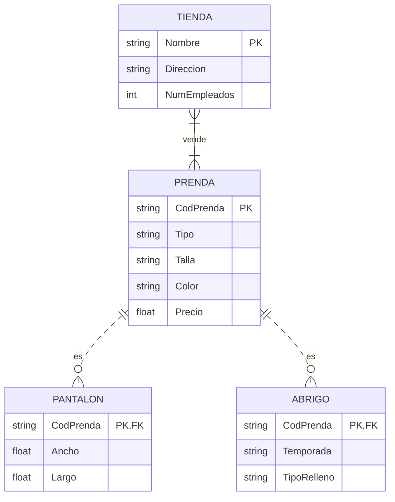
```mermaid
erDiagram
    TIENDA |{--|{ PRENDA : vende
    TIENDA {
        string Nombre PK
        string Direccion
        int NumEmpleados
    }
    PRENDA {
        string CodPrenda PK
        string Tipo
        string Talla
        string Color
        float Precio
    }
    %% ESPECIALIZACION!!
    PRENDA ||..O{ PANTALON : es
        PANTALON {
            string CodPrenda PK, FK
            float Ancho
            float Largo
        }
    PRENDA ||..O{ ABRIGO : es
        ABRIGO {
            string CodPrenda PK, FK
            string Temporada
            string TipoRelleno
        }
```

---

8. La cadena de Video-Clubs Glob-Gusters ha decidido, para mejorar su servicio, emplear una base de datos para almacenar la información referente a las películas que ofrece en alquiler. Esta información es la siguiente:
   - Una película se caracteriza por su título, nacionalidad, productora y fecha. *Puede haber varias películas con el mismo título pero rodadas en fechas distintas.*
   - En una película pueden participar varios actores (de los que almacenaremos nombre, nacionalidad y sexo), uno de ellos como protagonista.
   - Cada película está dirigida por un director (nombre, nacionalidad).
   - De cada película se dispone de uno o varios ejemplares diferenciados por un número de ejemplar y caracterizados por su estado de conservación.
   - Un ejemplar se puede encontrar alquilado a algún socio (DNI, nombre, dirección, teléfono). Se desea almacenar la fecha de comienzo del alquiler y la de devolución.
   - Un socio tiene que ser avalado por otro socio que responda de él en caso de tener problemas en el alquiler. Un socio puede no avalar a ningún otro, o a varios a la vez.

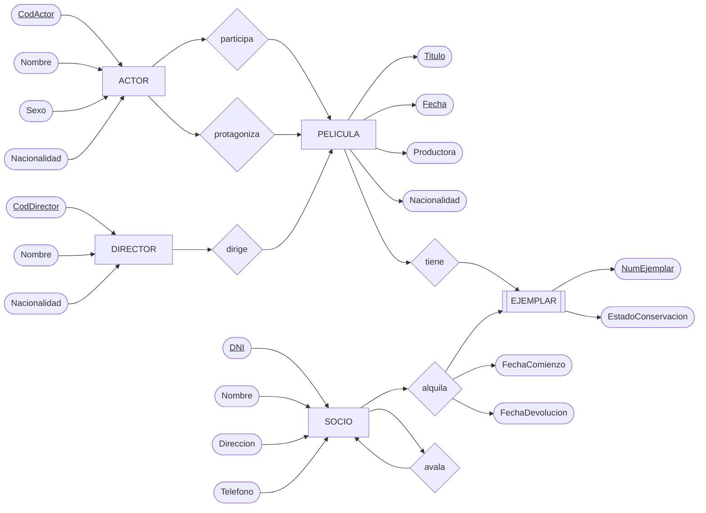
```mermaid
flowchart LR;

CodActor([<u>CodActor</u>]) --> ACTOR
NombreA([Nombre]) --> ACTOR[ACTOR]
Sexo([Sexo]) --> ACTOR
NacionalidadA([Nacionalidad]) --> ACTOR

CodDirector([<u>CodDirector</u>]) --> DIRECTOR
NombreD([Nombre]) --> DIRECTOR[DIRECTOR]
NacionalidadD([Nacionalidad]) --> DIRECTOR

DNI([<u>DNI</u>]) --> SOCIO
NombreS([Nombre]) --> SOCIO[SOCIO]
Direccion([Direccion]) --> SOCIO
Telefono([Telefono]) --> SOCIO

ACTOR --> participa{participa} --> PELICULA
ACTOR --> protagoniza{protagoniza} --> PELICULA
DIRECTOR --> dirige{dirige} --> PELICULA[PELICULA]

PELICULA --> Titulo([<u>Titulo</u>])
PELICULA --> Fecha([<u>Fecha</u>])
PELICULA --> Productora([Productora])
PELICULA --> NacionalidadP([Nacionalidad])

PELICULA --> tiene{tiene} --> EJEMPLAR[[EJEMPLAR]]
EJEMPLAR --> NumEjemplar([<u>NumEjemplar</u>])
EJEMPLAR --> EstadoConservacion([EstadoConservacion])

SOCIO --> alquila{alquila} --> EJEMPLAR
alquila --> FechaComienzo([FechaComienzo])
alquila --> FechaDevolucion([FechaDevolucion])

SOCIO --> avala{avala} --> SOCIO
```

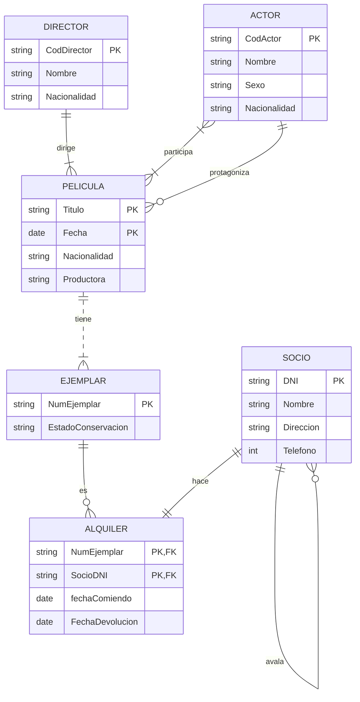
```mermaid
erDiagram
    DIRECTOR ||--|{ PELICULA : dirige
        DIRECTOR {
            string CodDirector PK
            string Nombre
            string Nacionalidad
        }
    ACTOR |{--|{ PELICULA : participa
        ACTOR {
            string CodActor PK
            string Nombre
            string Sexo
            string Nacionalidad
        }
    ACTOR ||--O{ PELICULA : protagoniza
        PELICULA {
            string Titulo PK
            date Fecha PK
            string Nacionalidad
            string Productora
        }
    PELICULA ||..|{ EJEMPLAR : tiene
        EJEMPLAR {
            string NumEjemplar PK
            string EstadoConservacion
        }
    EJEMPLAR ||--O{ ALQUILER : es
        ALQUILER {
            string NumEjemplar PK, FK
            string SocioDNI PK, FK
            date fechaComiendo
            date FechaDevolucion
        }
    SOCIO ||--|| ALQUILER : hace
        SOCIO {
            string DNI PK
            string Nombre
            string Direccion
            int Telefono
        }
    SOCIO ||--O{ SOCIO : avala
```

---

9. Un club de fans de la famosa película Startrek ha decidido crear una página web donde se pueda consultar información referente a todas las películas y capítulos de la saga. El dominio startrekfans.com se redirigirá a un servidor web que consulte una base de datos con la siguiente información:
    - Actores: Es necesario conocer el nombre completo del actor, el personaje que interpreta, la fecha de nacimiento y su nacionalidad.
    - Personajes: De los personajes es necesario saber el nombre, su raza y graduación militar que desempeña (capitán, teniente, almirante, etc.). Es importante conocer el actor que interpreta el personaje, teniendo en cuenta que un personaje sólo puede ser interpretado por un actor, y un actor sólo puede interpretar un personaje. Además, será necesario conocer el personaje del que depende directamente en graduación militar.
    - Capítulos: Hay que almacenar todos los capítulos, indicando a qué temporada pertenece cada capítulo, el título, el orden en el que fue rodado, fecha de su primera emisión en televisión y los personajes que participaron en cada capítulo.
    - Películas: Se deben almacenar también todas las películas que se proyectaron en cines, cada una con su año de lanzamiento, título y director. También hay que guardar los personajes que aparecen en cada película y cuál de ellos fue el protagonista.
    - Planetas: En cada capítulo se visita 1 o varios planetas; hay que almacenar el código del planeta, su nombre, galaxia a la que pertenece, y el problema que se resolvió en esa visita y la nave con la que se viajó al planeta. Para la descripción del problema será suficiente con un campo de texto de 255 caracteres. De la nave se almacenará el nombre, código y número de tripulantes.
    - Además, en cada capítulo, la nave que viaja a un planeta puede disponer de una nave pequeña llamada lanzadera, con la que bajan a la superficie del planeta. La existencia de la lanzadera sólo tiene sentido si existe la nave a la que pertenece. Se identificará cada lanzadera mediante un número entero y el código de su nave. Es necesario conocer la capacidad de personas de la lanzadera.
  - Posteriormente, se decide ampliar los requisitos de la base de datos, e incluir información extra para los personajes. De esta manera, si el personaje es humano, se indicará su fecha de nacimiento y ciudad terráquea donde nació. Si el personaje es de la raza Vulcano, se almacenará el nombre del mentor y la fecha de graduación, y si es de raza Klingon, se guardará su planeta natal y la fecha de su último combate.
  - Realiza un diagrama entidad/relación que modele el diseño de la base de datos.

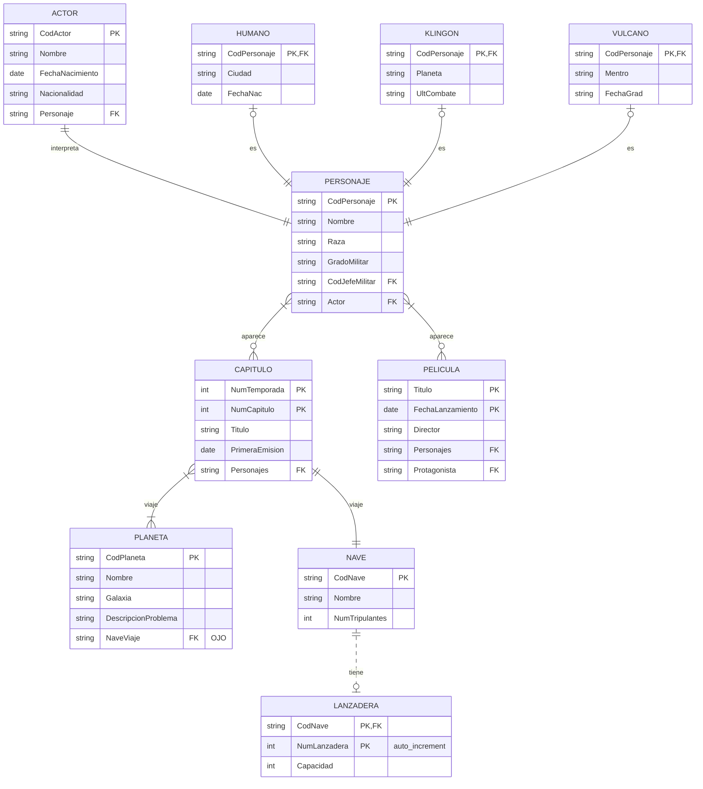
```mermaid
erDiagram
    ACTOR ||--|| PERSONAJE : interpreta
        ACTOR {
            string CodActor PK
            string Nombre
            date FechaNacimiento
            string Nacionalidad
            string Personaje FK
        }
        PERSONAJE {
            string CodPersonaje PK
            string Nombre
            string Raza
            string GradoMilitar
            %%string GradoMilitar "Capitan, Teniente, Almirante, ..."
            string CodJefeMilitar FK
            string Actor FK
        }
    HUMANO o|--|| PERSONAJE : es
        HUMANO {
            string CodPersonaje PK, FK
            string Ciudad
            date FechaNac
        }
    KLINGON o|--|| PERSONAJE : es
        KLINGON {
            string CodPersonaje PK, FK
            string Planeta
            string UltCombate
        }
    VULCANO o|--|| PERSONAJE : es
        VULCANO {
            string CodPersonaje PK, FK
            string Mentro
            string FechaGrad
        }
    PERSONAJE |{--o{ CAPITULO : aparece
        CAPITULO {
            int NumTemporada PK
            int NumCapitulo PK
            string Titulo
            date PrimeraEmision
            string Personajes FK
        }
    PERSONAJE |{--o{ PELICULA : aparece
        PELICULA {
            string Titulo PK
            date FechaLanzamiento PK
            string Director
            string Personajes FK
            string Protagonista FK
        }
    CAPITULO |{--|{ PLANETA : viaje
        PLANETA {
            string CodPlaneta PK
            string Nombre
            string Galaxia
            string DescripcionProblema
            string NaveViaje FK "OJO"
        }
    CAPITULO ||--|| NAVE : viaje
        NAVE {
            string CodNave PK
            string Nombre
            int NumTripulantes
        }
    NAVE ||..o| LANZADERA : tiene
        LANZADERA {
            string CodNave PK, FK
            int NumLanzadera PK "auto_increment"
            int Capacidad
        }
```

--- 

10. Realizar un esquema entidad/relación que sirva para almacenar información geográfica. Para ello hay que tener en cuenta:
    - Se almacenan los siguientes accidentes geográficos: ríos, lagos y montañas.
    - De cada accidente se almacenan su posición horizontal y vertical según el eje de la tierra,  además de su nombre.
    - De los ríos se almacena su longitud, de las montañas su altura y de los lagos su extensión.
    - Se almacena también información sobre cada país, su nombre, su extensión y su población.
    - Se desea almacenar información que permite saber en qué país está cada accidente geográfico, teniendo en cuenta que cada accidente puede estar en más de un país.
    - Se almacena también los nombres de cada localidad del país. Y se almacena por qué localidades pasa cada río, y cuántos km de río pasan por cada localidad.

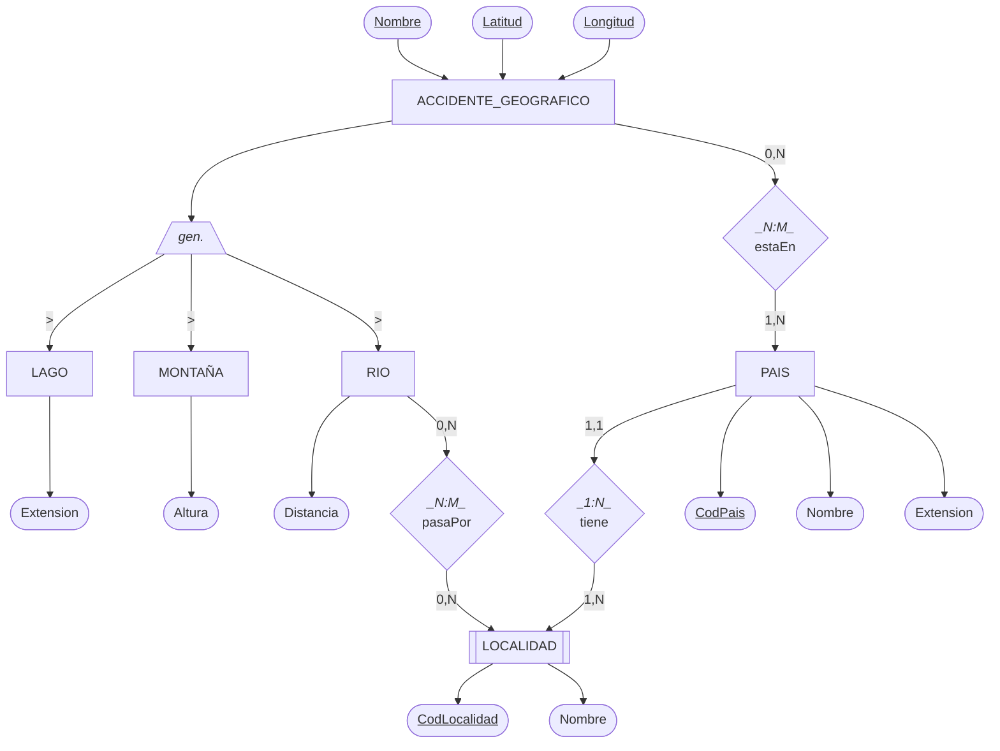
```mermaid
flowchart TD;

NombreAG([<u>Nombre</u>]) --> AG
Latitud([<u>Latitud</u>]) --> AG
Longitud([<u>Longitud</u>]) --> AG

AG[ACCIDENTE_GEOGRAFICO] --> esp[/<i>gen.</i>\]
    esp --> |>| LAGO --> Extension([Extension])
    esp --> |>| MONTAÑA --> Altura([Altura])
    esp --> |>| RIO --> Distancia([Distancia])

PAIS --> |1,1| tiene{<i>_1:N_</i><br>tiene} --> |1,N| LOCALIDAD[[LOCALIDAD]]

AG --> |0,N| estaEN{<i>_N:M_</i><br>estaEn} --> |1,N| PAIS[PAIS]
    PAIS --> CodPais([<u>CodPais</u>])
    PAIS --> NombreP([Nombre])
    PAIS --> ExtensionP([Extension])

RIO --> |0,N| pasaPor{<i>_N:M_</i><br>pasaPor} --> |0,N| LOCALIDAD
    LOCALIDAD --> CodLocalidad([<u>CodLocalidad</u>])
    LOCALIDAD --> NombreL([Nombre])
```

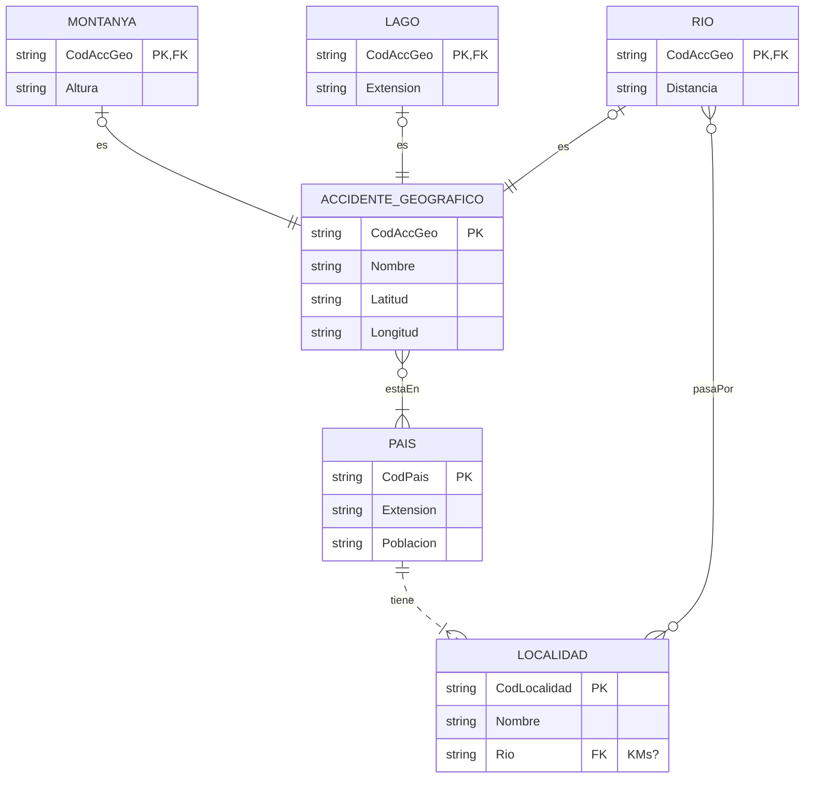
```mermaid
erDiagram

        ACCIDENTE_GEOGRAFICO {
        string CodAccGeo PK
        string Nombre
        string Latitud
        string Longitud
    }
    MONTANYA |o--|| ACCIDENTE_GEOGRAFICO : es
        MONTANYA {
            string CodAccGeo PK, FK
            string Altura
        }
    LAGO |o--|| ACCIDENTE_GEOGRAFICO : es
        LAGO {
            string CodAccGeo PK, FK
            string Extension
        }
    RIO |o--|| ACCIDENTE_GEOGRAFICO : es
        RIO {
            string CodAccGeo PK, FK
            string Distancia
        }
    ACCIDENTE_GEOGRAFICO o{--|{ PAIS : estaEn
        PAIS {
            string CodPais PK
            string Extension
            string Poblacion
        }
    PAIS ||..|{ LOCALIDAD : tiene
        LOCALIDAD {
            string CodLocalidad PK
            string Nombre
            string Rio FK "KMs?"
        }
    RIO o{--o{ LOCALIDAD : pasaPor
```