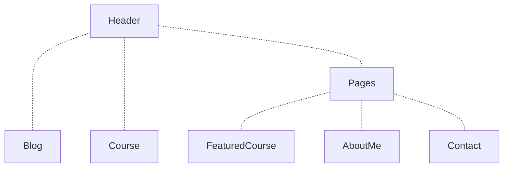
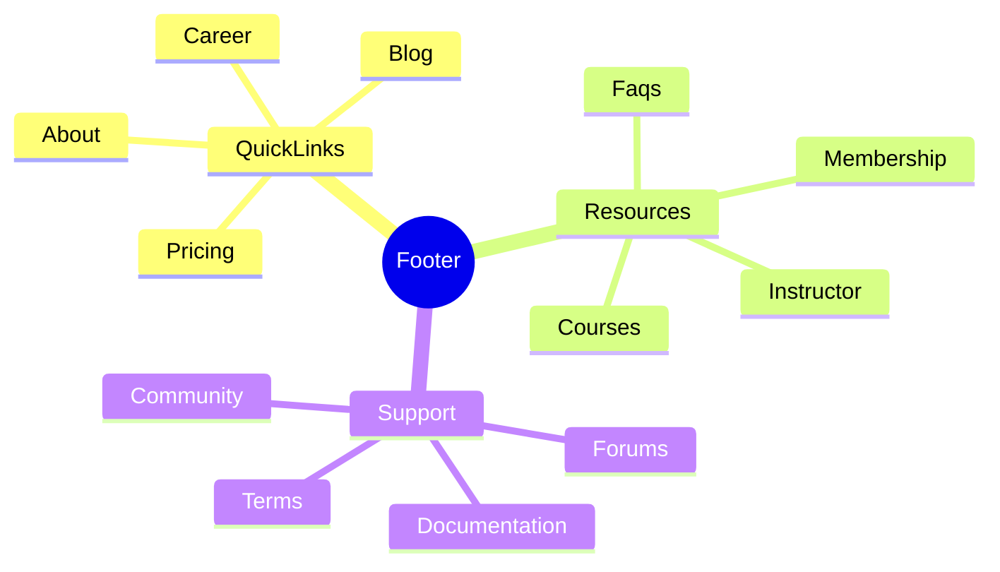
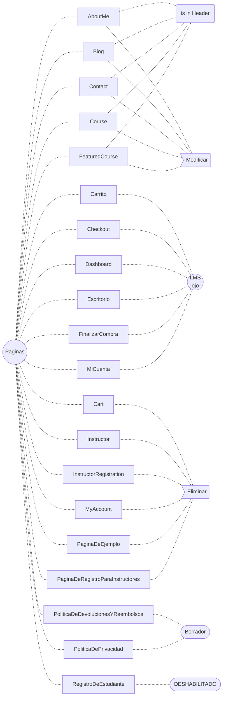

# WordPress en localhost

- [WordPress en localhost](#wordpress-en-localhost)
  - [Instalación LAMP + WordPress](#instalación-lamp--wordpress)
  - [WordPress 101](#wordpress-101)
  - [WordPress LMS](#wordpress-lms)
    - [TutorLMS: ocultar prefabricados](#tutorlms-ocultar-prefabricados)
    - [Tutor LMS: Asistente Config](#tutor-lms-asistente-config)
    - [Personalizar páginas con Elementor](#personalizar-páginas-con-elementor)
    - [Primer curso: vim](#primer-curso-vim)
    - [Taller de inglés](#taller-de-inglés)
  - [BEYOND -- !!!!!!!!!!!!!!!!!!!!!!!!!!!!!!!!!!!!!!!!!!!!!!!!!!!!!!!!!](#beyond----)
    - [Markdown \& syntax highlighting](#markdown--syntax-highlighting)


## Instalación LAMP + WordPress

- Automatizamos la instalación y configuración básica de Apache, MySQL, PHP y WordPress ejecutando mi script [DebUbu-services.sh](https://github.com/pabloqpacin/dotfiles/blob/main/scripts/autosetup/DebUbu-services.sh) en una máquina virtual Ubuntu 22.04.

```bash
wget https://raw.githubusercontent.com/pabloqpacin/dotfiles/main/scripts/autosetup/DebUbu-services.sh &&
    chmod +x DebUbu-services.sh && bash $_
```

- <!--[Aquí](#) describo el script y demuestro su correcta ejecución.--> Ya podemos completar la instalación de WordPress desde nuestro navegador web predeterminado.

```bash
xdg-open http://localhost
```

- En el menú de instalación, elegimos las siguientes opciones:

```yaml
# http://localhost/wp-admin/install.php
Lenguaje: Español       # English US -- para miSitio2.0

Titulo del sitio: pabloqpacin.com
Nombre de usuario: pabloqpacin
Contraseña: changeme
Email: no@thankyou.com
No visibilidad en motores de busqueda: yes
```

- Accedemos a nuestro sitio WordPress


```bash
xdg-open http://localhost/wp-login.php
```

## WordPress 101

- [ ] tema
- [ ] plugins
  - [ ] ~~Pods~~
  - [ ] Markdown
  - [x] ~~LifterLMS~~
  - [ ] TutorLMS
- [ ] personalización páginas:
  - [ ] sobre mí (homepage)
  - [ ] contacto
- [ ] BLOG
  - [ ] post_01
  - [ ] post_02
  - [ ] post_03
  - [ ] post_04

<!-- ```yaml
LifterLMS:
    Configuracion paginas:
        - Catalogo de cursos
        - Catalogo de miembros
        - Pantalla de compra
        - Tablero de instrumentos del estudiante
    Pagos:
        Pais: Spain (ES)
        Moneda: Euro
        Permitir pagos en linea: yes
    Cupon: no
    Importar cursos:
        - Course Template: yes
``` -->
---


- Ajustes básicos: permalinks postname

```yaml
Usuarios: Perfil:
  - Esquema de color: Moderno

Ajustes:
  Generales:
    - Formato de fecha: Y-m-d
    - Cualquiera puede registrarse: on
  Enlaces permanentes:
    - Estrucura: /%postname%/ (Nombre de la entrada)
```
<!-- # - Perfil por defecto para nuevos usuarios: Suscriptor 
Cualquiera puede suscribirse: YES/NO
-->


- Apariencia y plugins LMS

> TODO: markdown

```yaml
Apariencia: Temas:
  Añadir nuevo tema: TutorStarter (Añadir y Activar)
  Instalar plugins recomendados: TutorMate

Tutor Starter: Starter Sites:
  Instructor: Importar para Elementor
  # Instalación plugins: Elementor TutorLMS WooCommerce TutorLMSElementorAddons DemoContent
```

- Un poco de orden

```yaml
Plugins:
  Plugins instalados:
    - Hello Dolly: Borrar
  Añadir nuevo plugin: 'WP Githuber MD - WordPress Markdown Editor'


  
```

- Nueva estructura web:
  - **Header**: habrá que retocar
  - **Footer**: quitar morralla y vincular realmente
  - **Páginas**: puff





---




<!-- - Starter Site: 'Instructor' + plugins (Elementor, TutorLMS, WooCommerce...)

- Build Site
  - Page Builder
  - Add Pages & Add to Menu
  - Set up TutorLMS
  - Create Course (free atm)
  - Create Product (aka paid course)
- Build Courses -->


- Limpieza de DemoContent

```yaml
Medios: ...
```


## WordPress LMS

- [ ] servicios/talleres/cursos/suscripción
  - [ ] git
  - [ ] vim
  - [ ] inglés
  - [ ] linux
  - [ ] scripting
- [ ] MISC
  - [ ] header
  - [ ] footer
  - [ ] Tienda/Carrito
  - [ ] Política privacidad

### TutorLMS: ocultar prefabricados

```yaml
Entradas: eliminar prefabricadas
Ajustes: Lectura:
  Página de entradas: Blog

Tutor LMS:
  Cursos: ocultar todo
  Categorías:
  Etiquetas:
```

### Tutor LMS: Asistente Config

```yaml
Tutor LMS:
  Herramientas:
    Asistente de Configuración:
      Plataforma: Individual
      General: Perfil del alumno: on
      Curso: ...
      Pago: PayPal
  Ajustes:
    Curso:
      - Redirigir automáticamente: yes
      - Auto Submit: yes
      - Fuente de video: YouTube
    Monetización:
      - Motor de ecommerce: WooCommerce
      - Withraw Method: PayPal
    Diseño:
      - Características: PyR on
      - Colores: Ocean
      - Usar TutorPlayer para YouTube: yes
```

### Personalizar páginas con Elementor

- Homepage /instructor

```yaml
# Contenido prefabricado:
Cuatro figuras: CAMBIAR PALABRAS
Join a community of 3k devs: QUITAR
```

> MUCHO MÁS!!!

### Primer curso: vim

- Crear producto

```yaml
Productos: Añadir nuevo:
  - Título: 'Curso de Vim'
  - Datos del producto: virtual, para_tutor
  - Precio: 0.99
```

- Ajustes WooCommerce + PayPal

```yaml
WooCommerce: Ajustes:
  Cuentas y privacidad:
    - Permitir a los clientes crear una cuenta al finalizar la compra: yes

Plugins: Añadir nuevo plugin: 'Payments Plugins for PayPal WooCommerce'

# ...
```
<!-- > TODO -->

- Crear curso

```yaml
Tutor LMS: Cursos:
  Añadir nuevo:
    Titulo: vim
    Descripción: "En este curso veremos cómo navegar y editar texto en vim/neovim"
    Ajustes:
      - Estudiantes máximos: 0
      - Dificultad: Principiante
      - Curso público: no
      - P y R: yes
    Añadir producto: Pagado (Curso de Vim)
    Maquetador de cursos: === APARTE ABAJO ===
    ¿Qué aprenderé?: ...
    Público objetivo: ...
    Duración total: 1 hora
    Materiales incluidos: ...
    Requisitos/instrucciones: ...
    Vídeo: === YT ===
```

- Crear lecciones curso

```yaml
# TutorLMS: Cursos: Añadir nuevo:
  # Titulo: vim
  Maquetador de cursos:
    Añadir nuevo tema:
      - Titulo: "Instalación de vim/neovim"
      - Descripción: ...
      Lección: añadir 3
      Cuestionario: 2 preguntas
    Añadir nuevo tema:
      - Titulo: "Primeros pasos con vim"
      - Descripción: ...
    PUBLICAR
```

### Taller de inglés

- Crear PRODUCTO para curso no-gratis

```yaml
Productos: Añadir nuevo:
  - Nombre: 'Taller de inglés'
  - Datos del producto: Producto externo/afiliado
  - Descripción corta: ...
```

- Nuevo curso


```yaml
# ...
```

> ALL GOOD!!


---


## BEYOND -- !!!!!!!!!!!!!!!!!!!!!!!!!!!!!!!!!!!!!!!!!!!!!!!!!!!!!!!!!

### Markdown & syntax highlighting


- Try plugins related to `prism.js` as per ChatGPT

```yaml
Plugins: Añadir nuevo:
  - 'Code Block Syntax Highlighter for Elementor'
```

> SUPER IMPORTANTE


---

> habilitar thumbnails para enlaces de github
> - yoast seo
> - opengraph
> - ... (ChatGPT)