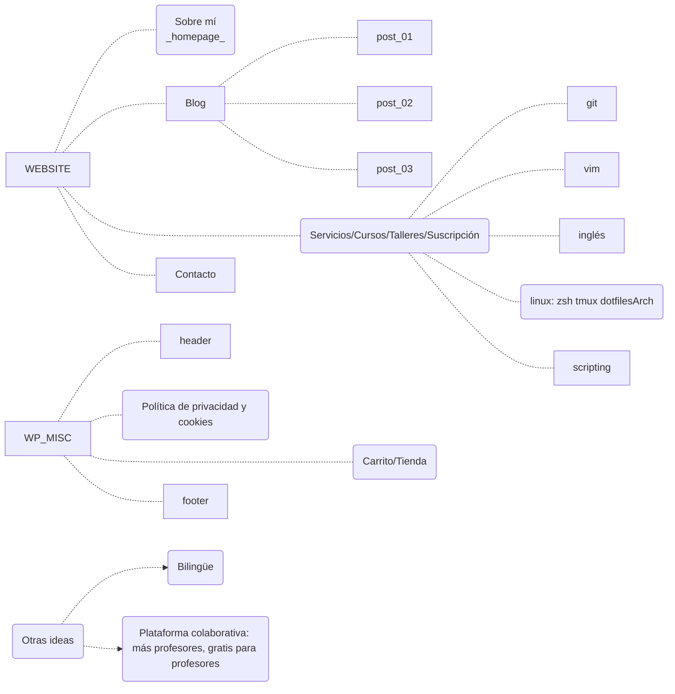

# miWeb -- pabloqpacin.com

- [miWeb -- pabloqpacin.com](#miweb----pabloqpacincom)
  - [PRE-DESARROLLO](#pre-desarrollo)
    - [PLAN](#plan)
    - [ESQUEMA](#esquema)
  - [DESARROLLO](#desarrollo)

<!--
    Ejemplos y documentación
- https://tonytascioglu.com/#portfolio (no WP)
- https://wppusher.com/wordpress-github/

    TODO
- Github Webhook
- Bilingüe
- Markdown

    To Mention
- https://wppusher.com/wordpress-github/
- 
-->

## PRE-DESARROLLO

### PLAN

1. Dominio
   - quiero que sea 'pabloqpacin.com'
   - contratarlo con:
     - IONOS
     - foo
2. Hosting
   - opciones:
      - en casa: ~~proxmox?~~ ~~RPi5?~~
      - en nube:
          - IONOS
          - Hostinger
   - infraestructura:
     - ~~VPS~~
     - WordPress web-hosting
3. Sitio Web
   - WordPress -- LMS (suscripción)
     - **LOCALHOST**

### ESQUEMA

---
## DESARROLLO

| arhivos         | contenido
| ---             | ---
| WP-localhost.md | Manual de acciones en WordPress
| servicios/*     | Planificación de servicios/cursos
| 
| 