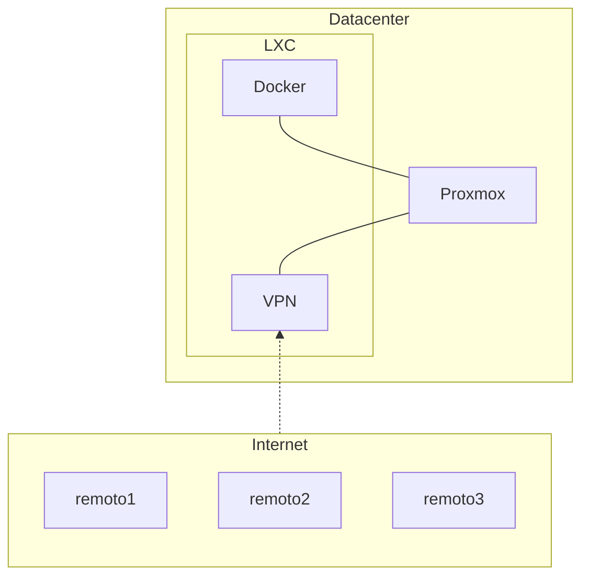
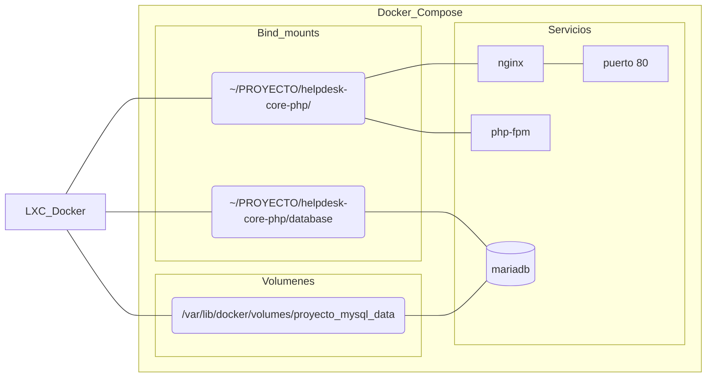

# Memoria

- [Memoria](#memoria)
  - [Objetivos](#objetivos)
    - [Objetivos Específicos](#objetivos-específicos)
  - [Tecnologías Empleadas](#tecnologías-empleadas)
    - [Material Empleado](#material-empleado)
    - [Desarrollo](#desarrollo)
      - [A. Base de datos](#a-base-de-datos)
      - [B. Intérprete de PHP y servidor web Nginx](#b-intérprete-de-php-y-servidor-web-nginx)
    - [Metodología Empleada](#metodología-empleada)
      - [1. Proxmox](#1-proxmox)
      - [2. Debian LXC para VPN Wireguard](#2-debian-lxc-para-vpn-wireguard)
      - [3. Debian LXC para webapp](#3-debian-lxc-para-webapp)
    - [Presupuesto](#presupuesto)

## Objetivos

- [ ] ...

### Objetivos Específicos

- [ ] ...

## Tecnologías Empleadas




---





### Material Empleado

- Hardware:
  - Nodo 1: HP Proliant D380p Gen.8 Procesadores: 2x Intel Xeon E5 2650v2 Ram: 64 Gb ECC Almacenamiento: 4x HDD SAS SFF 600Gb (raid 10) 
  - ~~Nodo 2: HP Prodesk 600 G1 Procesador Procesador Intel® Pentium® G3220 RAM 16GB Almacenamiento 512GB~~
- Sistemas Operativos: Proxmox sobre el hardware como el hipervisor anfitrión, ~~Ubuntu Server para las máquinas virtuales que alojan la aplicación web.~~ Contenedores LXC para alojar la VPN y la aplicación web de Ticketing
- Stack tecnológico: LEMP. Linux y Docker como plataforma/arquitectura, Nginx y Php-fpm para el servicio web, MariaDB para la base de datos.
- Otro Software: [repositorio en Github](https://github.com/pabloqpacin/lamp_docker) para el desarrollo y mantenimiento del código fuente 

### Desarrollo

El punto central de este proyecto es la puesta en funcionamiento *on-premise* de una aplicación web de Ticketing. Otro departamento de PJR.SOLUTIONS se ha ocupado de escribir el código PHP para el frontend. Nosotros nos hemos ocupado del backend, de coordinar el stack completo a través de Docker Compose y, en tanto que administradores de sistemas, del propio despliegue en un contenedor LXC Debian.

Durante el desarrollo de la webapp hemos intentado seguir una serie de buenas prácticas en la industria TIC propias de 2024:
- uso de Git para el control de versiones
- uso de un repositorio en Github para alojar y compartir el código fuente
- uso de Docker Compose para desplegar los servicios (base de datos, servidor web, *runtime* para Php...)

El repositorio de Git alojado en Github puede ser clonado en cualquier máquina virtual, contenedor LXC, etc., y en tanto que ese *host* tenga Docker instalado, podría poner en funcionamiento los servicios.

El elemento central del repositorio es el archivo `compose.yaml`, que define los distintos componentes del despliegue, sus características y permite integrarlos en una red virtual a su vez exponiendo los puertos necesarios.
Así, en lugar de instalar la base de datos en nuestro contenedor LXC o máquina virtual, Docker crea contenedores mucho más ligeros y portables, como ya se ha descrito más arriba.

---

El comando `docker compose up -d` creará una red Docker (tipo NAT; hacer pie de página a algo de documentación) y todos los elementos definidos. Los `services` se corresponden cada uno con un contenedor que llevará el nombre del servicio (`db`, `www`, etc.).

A continuación vamos a desgranar cada una de las partes del docker compose:

Apartados del compose:

| tabla
| ---
| está en mi Gugel Draif

```md
> Más documentación
- Volúmenes Docker VS Bind mounts:
  - https://iesgn.github.io/curso_docker_2021/sesion3/volumenes.html
```

#### A. Base de datos

```yaml
services:
  db:
    image: mariadb:11.2
    # ports:
    #   - "3306:3306"
    volumes:
      - ./helpdesk-core-php/database:/docker-entrypoint-initdb.d
      - mysql_data:/var/lib/mysql
    command: --default-authentication-plugin=caching_sha2_password
    env_file: mysql.properties
    restart:
      always

volumes:
    mysql_data:
```


- El apartado `image` define la versión del software a utilizar. En este caso, la imagen de MariaDB que hemos elegido es la 11.2 ([enlace a DockerHub](https://hub.docker.com/_/mariadb)). Por debajo, es Ubuntu (`docker exec -it proyecto-db-1 cat /etc/os-release`).
- Este contenedor abre de forma predefinida el puerto 3306 (el estándar para MySQL), lo que permite que la aplicación web PHP en ejecución en los otros contenedores pueda comunicarse a través de la Red Docker con este servidor de base de datos. Opcionalmente, podríamos mapear ese puerto a cualquier puerto disponible del host.<br> Inicialmente habíamos lo habíamos mapeado al propio 3306 del host para acceder remotamente con `mycli` pero ya no es necesario y siempre podemos acceder a la propia base de datos con `docker exec -it proyecto-db-1 mariadb -u admin -ppassword -D helpdesk_core_php`.


```txt
$ docker exec -it proyecto-db-1 ss -tuln
Netid   State   Recv-Q  Send-Q  Local Address:Port    Peer Address:Port    Process
udp     UNCONN  0       0          127.0.0.11:37382        0.0.0.0:*
tcp     LISTEN  0       80            0.0.0.0:3306         0.0.0.0:*
tcp     LISTEN  0       4096       127.0.0.11:32973        0.0.0.0:*
tcp     LISTEN  0       80               [::]:3306            [::]:*
```

- Usamos dos volúmenes para este contenedor:
  - El primero es un *bind mount* y nos permite montar los contenidos del directorio del host (a la izquierda) en el directorio `/docker-entrypoint-initdb.d` del contenedor (a la derecha). Según la configuración del contenedor, los archivos `.sql` presentes en ese directorio serán ejecutados, lo que nos permite crear nuestra base de datos a partir de estos archivos.
  - El segundo volumen, acompañado del apartado final `volumes: mysql_data:`, nos permite almacenar los propios archivos del servidor MariaDB (presentes en la ruta `/var/lib/mysql` del contenedor) en el sistema de archivos del host, en unos directorios administrados directamente por Docker (`/var/lib/docker`). En tanto que los contenidos del volumen se mapean al propio host, resulta posible eliminar los contenedores y al recrearlos, que se use este mismo volumen, lo que da persistencia a la base de datos. Este tipo de volúmenes puede ser usado por otros contenedores y ofrece más funcionalidades útiles.

```txt
$ sudo tree -L 2 /var/lib/docker/volumes/proyecto_mysql_data
/var/lib/docker/volumes/proyecto_mysql_data
└── _data
    ├── aria_log.00000001
    ├── aria_log_control
    ├── ddl_recovery.log
    ├── helpdesk_core_php
    ├── ib_buffer_pool
    ├── ibdata1
    ├── ib_logfile0
    ├── ibtmp1
    ├── mariadb_upgrade_info
    ├── multi-master.info
    ├── mysql
    ├── performance_schema
    ├── sys
    ├── tc.log
    ├── undo001
    ├── undo002
    └── undo003
```

- El comando `--default-authentication-plugin=caching_sha2_password` se añade para evitar un error que impediría la correcta integración del servidor de base de datos con el intérprete Php a través del módulo de Php `mysqli_connect()`.
- La instrucción `env_file` permite definir varios parámetros necesarios fuera del propio `docker-compose.yaml`, algo positivo para la limpieza del código en el repositorio. En este caso es preciso indicar la contraseña para root, un usuario que no sea root y su contraseña, la base de datos predefinida y la zona horaria para que el servidor de base de datos trabaje con la hora española (el parámetro `MYSQL_ROOT_HOST` existe para permitir conexiones desde fuera del contenedor con herramientas como `mycli`).

```c
MYSQL_USER='admin'
MYSQL_PASSWORD='password'
MYSQL_ROOT_PASSWORD='password'
MYSQL_DATABASE='helpdesk_core_php'
MYSQL_ROOT_HOST='%'
TZ='Europe/Madrid'
```

- Con la instrucción `restart: always`, el Docker daemon intentará levantar este conteneder después de un reinicio y en caso de parada, salvo que la parada la haga explícitamente un administrador (TODO: explicar mejor).


#### B. Intérprete de PHP y servidor web Nginx

<details>
<summary>OJO: Aproximación Teórica</summary>

> https://www.stackscale.com/es/blog/php-fpm-php-webs-alto-trafico/#Nginx_y_PHP-FPM_los_companeros_ideales

**Nginx y PHP-FPM: los compañeros ideales**

Nginx como servidor web de alto rendimiento estable, y con un consumo de recursos muy bajo, es el compañero ideal de PHP-FPM. Nginx tiene una arquitectura asíncrona que es mucho más escalable, basada en eventos. Además, al usar Nginx con PHP-FPM se mejora la eficiencia a nivel de consumo de memoria.

PHP funciona como un servicio separado al usar PHP-FPM. Al usar esta versión de PHP como intérprete del lenguaje, las peticiones se procesan a través de un socket TCP/IP; de modo que el servidor web Nginx solo maneja las peticiones HTTP y PHP-FPM interpreta el código PHP. El hecho de tener dos servicios separados es clave para ganar en eficiencia.

</details>


Antes de describir el apartado relevante del Docker Compose, hablemos de nuestro Dockerfile:


```dockerfile
FROM php:8.1.27-fpm-bullseye

RUN docker-php-ext-install mysqli && \
    docker-php-ext-enable mysqli

# COPY src/ /var/www/html/

EXPOSE 80
```

- La instrucción `FROM` indica qué imagen tomar como base. Nuestro contenedor tendrá como base Debian, Php versión 8.1, y funcionalidades FPM.
- Con `RUN` definimos las acciones a realizar sobre la imagen de la instrucción anterior. El resultado final será nuestra imagen particular. En este caso se instala el módulo `mysqli` que facilitará la integración de Php con nuestra base de datos.
- Con `COPY` podríamos montar directamente los archivos web (php, html, css) en la propia imagen pero esto nos restaría flexibilidad por lo que no está implementado.
- El apartado `EXPOSE` es simbólico ya que las imágenes no se ejecutan como tales. Simplemente es algo informativo acerca del comportamiento o caso de uso esperado.

Ahora sí, ya podemos comentar las líneas de nuestro `compose.yaml` acerca del intérpete de Php:


```yaml
services:
  php-fpm:
    build: ./php-fpm
    volumes:
      - ./helpdesk-core-php:/var/www/html
    restart:
      always
```

- Para la correcta integración de PHP con nuestra base de datos MariaDB, le indicamos a Docker que construya (`build`) nuestra propia imagen según se define en el Dockerfile descrito más arriba.
- De nuevo usaremos un *bind mount*, en este caso para montar los archivos de la web (alojados en el repositorio de Github y clonados junto con el propio `compose.yaml`) en el directorio relevante del contenedor.
- Al igual que antes, establecemos la política de rebotes para el reinio automático

Ya hemos hablado de nuestra base de datos y de la instalación de Php. Falta el último componente esencial: el servidor web.


```yaml
services:
  www:
    image: nginx:1.25.4-alpine
    ports:
      - "80:80"
    volumes:
      - ./helpdesk-core-php:/var/www/html
      - ./nginx/default.conf:/etc/nginx/conf.d/default.conf
    depends_on:
      - php-fpm
      - db
    restart:
      always
```

- Usamos una imagen de nginx muy ligera, la de Alpine.
- Mapeamos el puerto 80 del host (contenedor LXC) al puerto 80 del contenedor.
- Empleamos dos volúmenes:
  - Al igual que con `php-fpm`, montamos los archivos web en el directorio relevante (`/var/www/html`).
  - Asimismo, montamos el importante archivo de configuración de nginx que determina el funcionamiento funcionamiento del servicio.

```conf
server {
  index index.php index.html;
  server_name phpfpm.local;
  error_log  /var/log/nginx/error.log;
  access_log /var/log/nginx/access.log;
  root /var/www/html;

  location ~ \.php$ {
    try_files $uri =404;
    fastcgi_split_path_info ^(.+\.php)(/.+)$;
    fastcgi_pass php-fpm:9000;
    fastcgi_index index.php;
    include fastcgi_params;
    fastcgi_param SCRIPT_FILENAME $document_root$fastcgi_script_name;
    fastcgi_param PATH_INFO $fastcgi_path_info;
  }
}
```
- Con [depends_on](https://docs.docker.com/compose/compose-file/05-services/#depends_on) establecemos esta prioridad: `www` solo se levantará una vez que los otros dos servicios estén *'Ready'*, y será el primero en ser terminado en caso de `docker pause`, `docker stop` o `docker down`.
- Este contenedor también debería ser rebotado automáticamente.

Finalmente, cabe mencionar que durante las primeras fases de desarrollo habíamos incorporado un contenedor con [phpmyadmin](https://hub.docker.com/_/phpmyadmin), pero hemos dejado esas líneas comentadas, con lo que el entorno es más ligero.


### Metodología Empleada

#### 1. Proxmox
#### 2. Debian LXC para VPN Wireguard
#### 3. Debian LXC para webapp

### Presupuesto