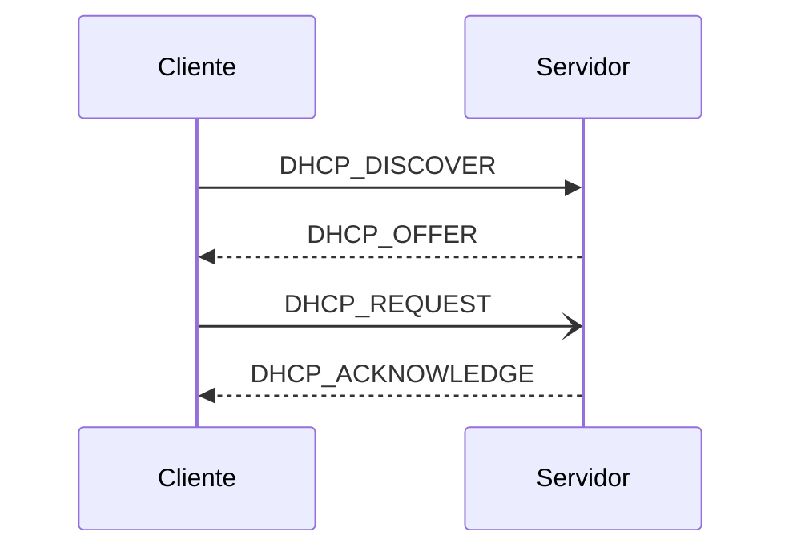

# Redes UD 1: DHCP

> VM: PopOS_22.04-Client
>
> `tshark`

- [Redes UD 1: DHCP](#redes-ud-1-dhcp)
  - [teoría](#teoría)
    - [apuntes](#apuntes)
  - [prácticas](#prácticas)
    - [DHCP en Ubuntu Server   ](#dhcp-en-ubuntu-server---)
    - [DHCP en Windows Server](#dhcp-en-windows-server)
    - [McGrawHill](#mcgrawhill)
      - [Caso pŕactico 1 -- /etc/netplan/\*](#caso-pŕactico-1----etcnetplan)
      - [Ejercicios 1 -- test](#ejercicios-1----test)
      - [~~Ponte a prueba 1~~](#ponte-a-prueba-1)
      - [Caso práctico 2 -- DORA](#caso-práctico-2----dora)
      - [Ponte a prueba 2 -- *relay*](#ponte-a-prueba-2----relay)
      - [Ejercicios 2 -- test](#ejercicios-2----test)
      - [Caso práctico 3 -- isc-dhcp-server](#caso-práctico-3----isc-dhcp-server)


## teoría

### apuntes

> [apuntes](/Redes/UD1-DHCP/apuntes.md)

```md
1. Configuración de los parámetros de red
1.1 Configuración de los parámetros de red
1.2 Parámetros de configuración de red
1.3 Configuración manual de parámetros de red
1.4 Configuración automática de parámetros de red
[2. El protocolo DHCP](#2-el-protocolo-dhcp)
[3. Administración del servicio DHCP](#3-administración-del-servicio-dhcp)
[4. Servidores autorizados. Seguridad del servicio DHCP](#4-servidores-autorizados-seguridad-del-servicio-dhcp)

```
## prácticas

### DHCP en Ubuntu Server   <!--Debian-->
### DHCP en Windows Server


### McGrawHill

#### Caso pŕactico 1 -- /etc/netplan/*

- En los sistemas GNU/Linux, si no se dispone de una herramienta gráfica de configuración de los parámetros de red, hay que realizar la configuración editando el archivo de configuración de dichos parámetros. <br> Se pide realizar la configuración manual o estática de la IP de un servidor Ubuntu. Recuerda que, en general, es muy conveniente que los servidores tengan este tipo de asignación de IP.

```bash
# Instalamos utilidades de red
sudo apt install net-tools

# Comprobamos dirección IP actual
ip -c a

# Localizamos el directorio que contiene el archivo de configuración de red y listamos su contenido. 
less /etc/netplan/*
```
```yaml
# /etc/netplan/01-network-manager-all.yaml              # UBUNTU
network:
    version: 2
    renderer: NetworkManager
```
<!-- ```yaml
# /etc/netplan/00-installer-config.yaml                 # POPOS
network:
  ethernets:
    enp0s3:
      dhcp4: true
  version: 2
``` -->

```bash
sudo nvim /etc/netplan/00-installer-config.yaml
```
```yaml
# /etc/netplan/01-network-manager-all.yaml              # UBUNTU
network:
    version: 2
    renderer: networkd
    ethernets:
        enp0s3:
            dhcp4: false
            addresses: [192.168.1.254/24]
            gateway4: 192.168.1.1
            nameservers:
                addresses: [8.8.8.8, 8.8.4.4]
```
```bash
# Aplicamos los cambios
sudo netplan apply

# FAIL !!!!!!!!!!!!

# # Usa /etc/netplan para generar la config de los manejadores (renderers)
# netplan generate

# # Validar la configuración
# netplan try

# # Aplicar la config para cada manejador
# netplan apply

# # Solucinonar problemas con el DNS
# sudo systemctl enable --now systemd-resolved
```

#### Ejercicios 1 -- test

1. Un ordenador tiene la IP 170.10.30.5 y máscara 255.255.0.0. Su identificador de red es... **170.10**
2. En la configuración manual o fija de los parámetros de red, indica cuál de los siguientes parámetros no se configura: **Servidor DHCP**
3. Un adaptador de red tiene IP 170.10.30.1 y máscara 255.255.0.0. En esa IP, indica cuál es el identificador del host o del adaptador dentro de la red.: **30.1**
4. "Es obligatorio que la puerta de enlace predeterminada y los servidores DNS que se establezcan en la configuración de red de un ordenador estén en la misma red que el ordenador para que este pueda conectarse y trabajar en Internet": **Falso**
5. En la configuración de los adaptadores de red, si se quiere que la IP se asigne mediante DHCP, indica cuál debe ser el valor asignado al parámetro *renderer*: **renderer: NetworkManager**

#### ~~Ponte a prueba 1~~

#### Caso práctico 2 -- DORA

- Se pide localizar y explicar con detalle los diferentes mensajes que intercambias entre sí el servidor DHCP y el cliente para realizar la concesión de los parámeros de red.



```yaml
# DORA
DHCP_DISCOVER: cliente -> 255.255.255.255 == any DHCP server
DHCP_OFFER: server -> cliente; MAC cliente, IP ofrecida y la del server, mask, lease-time
    # SI NO RECIBE offer EN 1 SEG: reenvía DISCOVER a los 2 4 8 y 16 segs; error o IP APIPA en Win (169.254.0.0 - 169.254.255.254) y pregunta cada 5 mins
    # SI cliente QUIERE ACEPTAR ip: mensaje DIFUSIÓN para informar a otros servidores
    # TODO: el mensaje es al servidor o de difusión, aka 1 o 2 mensajes?
        # OPINION: multicast si nueva conexión, unicast si renovación
DHCP_REQUEST: cliente -> servidor; aceptar o renovar IP;; OJO tb mensaje DIFUSIÓN
DHCP_ACK: ...

DHCP_NACK: raro, tipo servidor deniega IP tras ofrecerla
DHCP_DECLINE: si cliente detecta IP ofrecida ya en uso
DHCP_RELEASE: cliente quiere liberar la IP

DHCP_INFORM: cliente solicita parámetros adicionales (o actualización)
```


#### Ponte a prueba 2 -- *relay* 

- El servicio DHCP necesita que haya al menos un servidor DHCP en cada red en la que existan clientes DHCP. <br> Pero, si una organización ha estructurado su red informática en varias subredes con clientes DHCP, ¿no sería excesivo tener en funcionamiento servidores DHCP en todas las subredes? ¿Sería preferible disponer de un servidor DHCP que centralizase el servicio para todas las subredes? <br> Se pide averiguar qué es un agente relay de DHCP y cómo funciona.

> TODO: ...


#### Ejercicios 2 -- test

1. De los siguientes mensajes DHCP, indica cuál de ellos no es enviado de cliente a servidor DHCP: **DHCP_ACK**
2. Cuando un cliente DHCP solicita la *renovación* de una concesión DHCP, el primer mensaje que envía es: **DHCP_REQUEST**
3. En un proceso normal de solicitud y asignación de una IP en un cliente DHCP desde un servidor, se transmiten mensajes DHCP en este orden: **DISCOVER > OFFER > REQUEST > ACK**
4. Indica cuál de los siguientes parámetros no se considera obligatorio para ser entregado por un servidor DHCP a los clientes: **Direcciones IP de los servidores DNS**
5. Señala el método de asignación DHCP en el que un mismo adaptador de red no puede recibir desde un mismo servidor diferentes direcciones IP: **Asignación Manual**


#### Caso práctico 3 -- isc-dhcp-server

```md
Independientemente del sistema operativo que se esté utilizando, los servidores DHCP deben cumplir una serie de requisitos:
- La instalación del servicio DHCP.
- Una dirección IP estática, una máscara de subred y, si es necesario, una puerta de enlace predeterminada.
- Un intervalo de direcciones IP válidas, para asignar o conceder a los clientes.

ISC (Internet Systems Consortium) desarrolla de forma oficial software libre DHCP para sistemas GNU/Linux. En concreto, desarrolla tres paquetes de software:
1. Software servidor DHCP.
2. Software cliente DHCP.
3. Software agente relay DHCP.
En Ubuntu, la última versión del servidor DHCP es isc-dhcp-server, que se corresponde con DHCP v4.4. 
> Se pide instalar el servicio DHCP y realizar la configuración básica para que funcione. 
```
```bash
# Instalar el servicio DHCP en Ubuntu Server
sudo apt install isc-dhcp-server
```
```bash
# Hay que tener en cuenta que, si el equipo tiene más de una tarjeta de red, se ha de indicar al servicio DHCP sobre cuál de ellas tiene que escuchar y atender peticiones. 
# Para ello, hay que incluir al comienzo del archivo '/etc/default/isc-dhcp-server' la tarjeta sobre la que tiene que escuchar el servicio. En nuestro caso, enp1s0, pero podría ser otra (eth0, enp0s3...).
# INTERFACESv4="enp1s0"

# sudo nvim /etc/default/isc-dhcp-server
iscdhcp_configfile='/etc/default/isc-dhcp-server'
interfaz=$(ip -o link show | grep -v 'lo' | awk -F ': ' '{print $2}')
# sed -i 's/INTERFACESv4=""/INTERFACESv4="${interfaz}"/' your_file.txt
sed -i "s/INTERFACESv4=\"\"/INTERFACESv4=\"$interfaz\"/" $iscdhcp_configfile
```

```bash
# Al instalar el paquete, se puede comprobar que no ha arrancado el servicio ejecutando la orden
sudo systemctl status isc-dhcp-server 
# Nos dice que está inactivo. Esto es debido a que requiere un mínimo de configuración para que se ejecute correctamente. En concreto, requiere que se le indique el rango de direcciones IP de las que dispone para atender peticiones.
```
```bash
# Vamos al archivo /etc/dhcp/dhcpd.conf y hacemos las modificaciones siguientes:
sudo mv /etc/dhcp/dhcpd.conf{,.bak}
sudo nvim /etc/dhcp/dhcpd.conf
  # subnet 192.168.1.0 netmask 255.255.255.0 {
  # 	range 192.168.1.10   192.168.1.20; 
  # }

# Arrancamos el servicio y, al ver el status de nuevo, comprobamos que ya se está ejecutando:
sudo systemctl start isc-dhcp-server 
sudo systemctl status isc-dhcp-server 
```
```bash
```
```bash
```
```bash
```
```bash
```
```bash
```
```bash
```
```bash
```
