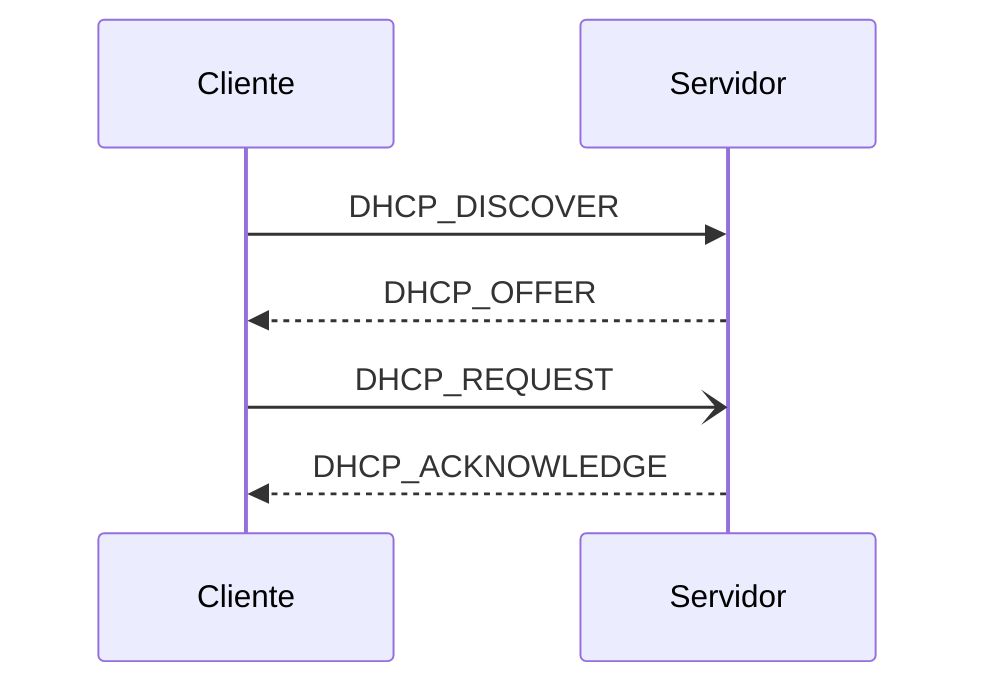

# Redes UD1: DHCP

<!-- > VM: PopOS_22.04-Client
>
> `tshark` -->

- [Redes UD1: DHCP](#redes-ud1-dhcp)
  - [teoría](#teoría)
    - [apuntes](#apuntes)
  - [prácticas](#prácticas)
    - [DHCP en Ubuntu Server   ](#dhcp-en-ubuntu-server---)
    - [DHCP en Windows Server](#dhcp-en-windows-server)
    - [McGrawHill](#mcgrawhill)
      - [Caso pŕactico 1 -- /etc/netplan/\*](#caso-pŕactico-1----etcnetplan)
      - [Ejercicios 1 -- test](#ejercicios-1----test)
      - [~~Ponte a prueba 1~~](#ponte-a-prueba-1)
      - [Caso práctico 2 -- DORA](#caso-práctico-2----dora)
      - [Ponte a prueba 2 -- *relay*](#ponte-a-prueba-2----relay)
      - [Ejercicios 2 -- test](#ejercicios-2----test)
      - [Caso práctico 3 -- isc-dhcp-server](#caso-práctico-3----isc-dhcp-server)
      - [Ponte a prueba 3 -- comandos DHCP](#ponte-a-prueba-3----comandos-dhcp)
      - [(!) Estudio de caso -- configuración básica servicio DHCP](#-estudio-de-caso----configuración-básica-servicio-dhcp)
      - [Ejercicios 3 -- test](#ejercicios-3----test)
      - [Caso práctico 4 -- DHCP *spoofing*/*snooping*](#caso-práctico-4----dhcp-spoofingsnooping)
      - [Ponte a prueba 4 - DHCP en el router](#ponte-a-prueba-4---dhcp-en-el-router)
      - [(!) Estudio del caso -- config subred y equipos del grupo](#-estudio-del-caso----config-subred-y-equipos-del-grupo)
      - [Ejercicios 4 -- test](#ejercicios-4----test)


## teoría

### apuntes

> [apuntes.md](/Redes/UD1-DHCP/apuntes.md)

```md
> Unidad 1 McGrawHill  Servicio de Configuración Automática de Red (DHCP)
1. Configuración de los parámetros de red
  1.1 Configuración de los parámetros de red
  1.2 Parámetros de configuración de red
  1.3 Configuración manual de parámetros de red
  1.4 Configuración automática de parámetros de red
2. El protocolo DHCP
  2.1 Tipos de asignaciones en DHCP
  2.2 (!) Proceso de concesión
  2.3 Parámetros asignados por DHCP
3. Administración del servicio DHCP
  3.1 Archivos y directorios del servicio DHCP
  3.2 El archivo de configuración del servicio DHCP: `dhcpd.conf`
    3.2.1 Tipos de declaraciones
    3.2.2 Tipos de parámetros
4. Servidores autorizados. Seguridad del servicio DHCP
  4.1 Servidores Autorizados
  4.2 Seguridad del servicio DHCP
```
## prácticas

### DHCP en Ubuntu Server   <!--Debian-->

> [Redes/scripts/UD1-UbuntuServer-DHCP.sh](/Redes/scripts/UD1-UbuntuServer-DHCP.sh)

### DHCP en Windows Server

> ...

### McGrawHill

#### Caso pŕactico 1 -- /etc/netplan/*

- En los sistemas GNU/Linux, si no se dispone de una herramienta gráfica de configuración de los parámetros de red, hay que realizar la configuración editando el archivo de configuración de dichos parámetros. <br> Se pide realizar la configuración manual o estática de la IP de un servidor Ubuntu. Recuerda que, en general, es muy conveniente que los servidores tengan este tipo de asignación de IP.

```bash
# Instalamos utilidades de red
sudo apt install net-tools

# Comprobamos dirección IP actual
ip -c a

# Localizamos el directorio que contiene el archivo de configuración de red y listamos su contenido. 
less /etc/netplan/*
```
```yaml
# /etc/netplan/01-network-manager-all.yaml              # UBUNTU
network:
    version: 2
    renderer: NetworkManager
```
<!-- ```yaml
# /etc/netplan/00-installer-config.yaml                 # POPOS
network:
  ethernets:
    enp0s3:
      dhcp4: true
  version: 2
``` -->

```bash
sudo nvim /etc/netplan/00-installer-config.yaml
```
```yaml
# /etc/netplan/01-network-manager-all.yaml              # UBUNTU
network:
    version: 2
    renderer: networkd
    ethernets:
        enp0s3:
            dhcp4: false
            addresses: [192.168.1.254/24]
            gateway4: 192.168.1.1
            nameservers:
                addresses: [8.8.8.8, 8.8.4.4]
```
```bash
# Aplicamos los cambios
sudo netplan apply

# FAIL !!!!!!!!!!!!

# # Usa /etc/netplan para generar la config de los manejadores (renderers)
# netplan generate

# # Validar la configuración
# netplan try

# # Aplicar la config para cada manejador
# netplan apply

# # Solucinonar problemas con el DNS
# sudo systemctl enable --now systemd-resolved
```

#### Ejercicios 1 -- test

1. Un ordenador tiene la IP 170.10.30.5 y máscara 255.255.0.0. Su identificador de red es... **170.10**
2. En la configuración manual o fija de los parámetros de red, indica cuál de los siguientes parámetros no se configura: **Servidor DHCP**
3. Un adaptador de red tiene IP 170.10.30.1 y máscara 255.255.0.0. En esa IP, indica cuál es el identificador del host o del adaptador dentro de la red.: **30.1**
4. "Es obligatorio que la puerta de enlace predeterminada y los servidores DNS que se establezcan en la configuración de red de un ordenador estén en la misma red que el ordenador para que este pueda conectarse y trabajar en Internet": **Falso**
5. En la configuración de los adaptadores de red, si se quiere que la IP se asigne mediante DHCP, indica cuál debe ser el valor asignado al parámetro *renderer*: **renderer: NetworkManager**

#### ~~Ponte a prueba 1~~

#### Caso práctico 2 -- DORA

- Se pide localizar y explicar con detalle los diferentes mensajes que intercambias entre sí el servidor DHCP y el cliente para realizar la concesión de los parámeros de red.



```yaml
# DORA
DHCP_DISCOVER: cliente -> 255.255.255.255 == any DHCP server
DHCP_OFFER: server -> cliente; MAC cliente, IP ofrecida y la del server, mask, lease-time
    # SI NO RECIBE offer EN 1 SEG: reenvía DISCOVER a los 2 4 8 y 16 segs; error o IP APIPA en Win (169.254.0.0 - 169.254.255.254) y pregunta cada 5 mins
    # SI cliente QUIERE ACEPTAR ip: mensaje DIFUSIÓN para informar a otros servidores
    # TODO: el mensaje es al servidor o de difusión, aka 1 o 2 mensajes?
        # OPINION: multicast si nueva conexión, unicast si renovación
DHCP_REQUEST: cliente -> servidor; aceptar o renovar IP;; OJO tb mensaje DIFUSIÓN
DHCP_ACK: ...

DHCP_NACK: raro, tipo servidor deniega IP tras ofrecerla
DHCP_DECLINE: si cliente detecta IP ofrecida ya en uso
DHCP_RELEASE: cliente quiere liberar la IP

DHCP_INFORM: cliente solicita parámetros adicionales (o actualización)
```


#### Ponte a prueba 2 -- *relay* 

- El servicio DHCP necesita que haya al menos un servidor DHCP en cada red en la que existan clientes DHCP. <br> Pero, si una organización ha estructurado su red informática en varias subredes con clientes DHCP, ¿no sería excesivo tener en funcionamiento servidores DHCP en todas las subredes? ¿Sería preferible disponer de un servidor DHCP que centralizase el servicio para todas las subredes? <br> Se pide averiguar qué es un agente relay de DHCP y cómo funciona.

> TODO: ...


#### Ejercicios 2 -- test

1. De los siguientes mensajes DHCP, indica cuál de ellos no es enviado de cliente a servidor DHCP: **DHCP_ACK**
2. Cuando un cliente DHCP solicita la *renovación* de una concesión DHCP, el primer mensaje que envía es: **DHCP_REQUEST**
3. En un proceso normal de solicitud y asignación de una IP en un cliente DHCP desde un servidor, se transmiten mensajes DHCP en este orden: **DISCOVER > OFFER > REQUEST > ACK**
4. Indica cuál de los siguientes parámetros no se considera obligatorio para ser entregado por un servidor DHCP a los clientes: **Direcciones IP de los servidores DNS**
5. Señala el método de asignación DHCP en el que un mismo adaptador de red no puede recibir desde un mismo servidor diferentes direcciones IP: **Asignación Manual**


#### Caso práctico 3 -- isc-dhcp-server

```md
Independientemente del sistema operativo que se esté utilizando, los servidores DHCP deben cumplir una serie de requisitos:
- La instalación del servicio DHCP.
- Una dirección IP estática, una máscara de subred y, si es necesario, una puerta de enlace predeterminada.
- Un intervalo de direcciones IP válidas, para asignar o conceder a los clientes.

ISC (Internet Systems Consortium) desarrolla de forma oficial software libre DHCP para sistemas GNU/Linux. En concreto, desarrolla tres paquetes de software:
1. Software servidor DHCP.
2. Software cliente DHCP.
3. Software agente relay DHCP.
En Ubuntu, la última versión del servidor DHCP es isc-dhcp-server, que se corresponde con DHCP v4.4. 
> Se pide instalar el servicio DHCP y realizar la configuración básica para que funcione. 
```
```bash
# Instalar el servicio DHCP en Ubuntu Server
sudo apt install isc-dhcp-server
```
```bash
# Hay que tener en cuenta que, si el equipo tiene más de una tarjeta de red, se ha de indicar al servicio DHCP sobre cuál de ellas tiene que escuchar y atender peticiones. 
# Para ello, hay que incluir al comienzo del archivo '/etc/default/isc-dhcp-server' la tarjeta sobre la que tiene que escuchar el servicio. En nuestro caso, enp1s0, pero podría ser otra (eth0, enp0s3...).
# INTERFACESv4="enp1s0"

# sudo nvim /etc/default/isc-dhcp-server
iscdhcp_configfile='/etc/default/isc-dhcp-server'
interfaz=$(ip -o link show | grep -v 'lo' | awk -F ': ' '{print $2}')
# sed -i 's/INTERFACESv4=""/INTERFACESv4="${interfaz}"/' your_file.txt
sed -i "s/INTERFACESv4=\"\"/INTERFACESv4=\"$interfaz\"/" $iscdhcp_configfile
```
```bash
# Al instalar el paquete, se puede comprobar que no ha arrancado el servicio ejecutando la orden
sudo systemctl status isc-dhcp-server 
# Nos dice que está inactivo. Esto es debido a que requiere un mínimo de configuración para que se ejecute correctamente. En concreto, requiere que se le indique el rango de direcciones IP de las que dispone para atender peticiones.
```
```bash
# Vamos al archivo /etc/dhcp/dhcpd.conf y hacemos las modificaciones siguientes:
sudo mv /etc/dhcp/dhcpd.conf{,.bak}
sudo nvim /etc/dhcp/dhcpd.conf
  # subnet 192.168.1.0 netmask 255.255.255.0 {
  # 	range 192.168.1.10   192.168.1.20; 
  # }

# Arrancamos el servicio y, al ver el status de nuevo, comprobamos que ya se está ejecutando:
sudo systemctl start isc-dhcp-server 
sudo systemctl status isc-dhcp-server 
```
```bash
sudo dhpd
  # Can't open /var/lib/dhcp/dhcpd.leases

journalctl PID
```
```bash
# CLIENTES

sudo apt-get install isc-dhcp-client
less /etc/NetworkManager/NetworkManager.confd
dhclient -r && dhclient
```

#### Ponte a prueba 3 -- comandos DHCP

```md
> Comandos relacionados con DHCP (GNU/Linux Ubuntu)
Con toda seguridad, necesitaremos utilizar algunos comandos de red que nos ayuden a verificar datos importantes para la configuración del servicio DHCP y otros específicos del servicio.
Se pide describir los comandos que pueden ser necesarios para la comprobación o el funcionamiento del servicio DHCP.
```
```bash
# ...
```

#### (!) Estudio de caso -- configuración básica servicio DHCP

> TODO


#### Ejercicios 3 -- test

1. Indica en qué directorio se encuentra el archivo de configuración dhcpd.conf en sistemas Ubuntu: **/etc/dhcp**
2. Indica en qué declaración del archivo de configuración dhcpd.conf se deben especificar los rangos de direcciones IP que se asignan dinámicamente: **subnet**
3. De los siguientes comandos, indica cuál no se debe usar en sistemas GNU/Linux Ubuntu relacionados con el funcionamiento de DHCP y la configuración de red: **ifup**
4. De los siguientes comandos, indica cuál se utiliza para detener el servicio DHCP en sistemas GNU/Linux Ubuntu: **...**
5. El paquete para instalar el servidor DHCP de ISC en sistemas GNU/Linux Ubuntu se llama: **isc-dhcp-server**


#### Caso práctico 4 -- DHCP *spoofing*/*snooping*

```md
El ataque DHCP spoofing (suplantación) se basa en el despliegue de servidores DHCP no fiables que asignan parámetros de configuración de red falsos a los equipos finales, con los siguientes objetivos:
1. Comprometer la disponibilidad de la red (ataque DoS), asignando, por ejemplo, direcciones IP incorrectas a los equipos para que pierdan la conectividad con el resto de la red.
2. Redirigir el tráfico para que atraviesen otros sistemas maliciosos (ataque man-in-the-middle) para interceptar los mensajes enviados y poder realizar acciones como el robo de datos y credenciales.

El principal problema que presenta DHCP se debe a la incapacidad de distinguir los servidores legítimos de los que no lo son, que es lo que hace que sea sencillo incorporar servidores DHCP falsos en los sistemas de usuarios conectados a la red.
Para evitar ataques DHCP spoofing, los switches incluyen la funcionalidad DHCP snooping, que permite configurar los puertos y direcciones de los servidores DHCP legítimos, y así filtrar todos los mensajes DHCP procedentes de servidores no autorizados.

> Se pide configurar el switch para activar la funcionalidad DHCP snooping.
> Se propone una topología muy sencilla con un rúter, un switch y un equipo. autorizados.

| Dispositivos  | Interfaz/VLAN | Direccion IP  | Mascara de subred
| ---           | ---           | ---           | ---
| R1            | G0/0/0        | 192.168.1.1   | /24
| S1            | VLAN 10       | 192.168.1.100 | /24
| PC1           | NIC           | DHCP          | /24
```

```md
Paso 1. Configurar los dispositivos de red
- Conectar la red.
- Configurar R1.
- Configurar y verificar los parámetros básicos del switch.

Router> enable
Router# configure terminal
Router(config)# hostname R1
R1 (config)# service dhcp
R1 (config)# ip dhcp excluded-address 192.168.1.1 192.168.1.9
R1 (config)# ip dhcp pool Aula
R1 (dhcp-config)# network 192.168.1.0 255.255.255.0
R1 (dhcp-config)# default-router 192.168.1.1
R1 (dhcp-config)# dns-server 8.8.8.8
R1 (dhcp-config)# domain-name CP-A4

Lo que hemos hecho es lo siguiente:
- Le damos un rango de IPs que hay que excluir del direccionamiento.
- Le damos un nombre al pool de direccionamiento.
- Le decimos el pool de direcciones IP.
- Señalamos la IP que será la puerta de enlace.
- Indicamos la IP del servidor DNS que utilizarán los hosts.

Guardamos la nueva config del router
R1# copy running-config startup-config

Mostramos la información del pool Aula y etc...
R1# show dhcp pool
...
R1(config)# no ip dhcp pool Nombre_pool
R1# show ip interface brief
```
```md
Configuración VLAN en switch:

Switch> enable
Switch# config t
Switch (config)# hostname S1
S1 (config)# vlan 10
S1 (config-vlan)# name Administracion
S1 (config-vlan)# exit
S1 (config)# interface vlan 10
S1 (config-if)# ip address 192.168.1.100 255.255.255.0
S1 (config-if)# no shutdown
S1 (config)# ip default-gateway 192.168.1.1
S1 (config)# interface range f0/2 - 3
S1 (config-if-range)# switchport mode access
S1 (config-if-range)# switchport access vlan 10
... -- deshabilitar puertos no utilizados
S1# show int status

Implementar DHCP snooping
- Una vez activada la inspección DHCP en una VLAN, todos los puertos participantes pasan a ser no confiables, y se filtrará cualquier mensaje DHCP de los enviados por los servidores. Cuando declaramos un puerto como confiable, se aceptarán los mensajes DHCP de servidor procedentes de él, independientemente de la dirección IP de la que procedan.
- Espeficiar puertos conectados a los servidores DHCP como de confianza
- Creación entrada estática en la tabla DHCP para reforzar la seguridad

S1 (config)# ip dhcp snooping
S1 (config)# ip dhcp snooping vlan 10
S1 (config)# interface f0/1

ip dhcp snooping vlan name
OS10 (conf)# ip dhcp snooping binding mac mac-address vlan vlan-id ip ip-address interface
[ethernet slot/port/sub-port | port-channel port-channel-id | VLTi]

Verificar configuración DHCP snooping:
S1# show ip dhcp snooping

Comandos de verificación:
R1# show ip dhcp conflict
R1# show ip dhcp binding
R1# show ip dhcp server statistics
```

```md
Desde el CMD del cliente, liberamos y renovamos la dirección IP
ipconfig /release
ipconfig /renew
```

#### Ponte a prueba 4 - DHCP en el router

```md
El servicio DHCP, por defecto, está activado en los rúteres que proporcionan los proveedores de servicios de Internet (ISP) a sus clientes, y en general, en todos ellos.
Este servicio DHCP asigna direcciones IP de forma dinámica a todos los dispositivos que conectan en red tanto por cable Ethernet como por wifi. De esta forma, el usuario no tiene que configurar nada.
> Se pide hacer un breve análisis sobre las ventajas y los inconvenientes que tiene el hecho de estar este servicio activado por defecto.
```


#### (!) Estudio del caso -- config subred y equipos del grupo

- ...


#### Ejercicios 4 -- test

1. Si se recibe una configuración DHCP no permitida, se manda un mensaje DHCPNack denegando esa configuración. Indica cuál es, de los siguientes, el parámetro utilizado para ello: **authoritative**
2. Indica cuál de las siguientes afirmaciones es verdadera: **El servidor DHCP mantiene una base datos con las conexiones activas.**
3. Indica cuál de las siguientes situaciones no se podrá resolver mediante un servidor DHCP: **Un equipo no autorizado con una IP válida puede acceder a la red.**
4. Indica cuál de las siguientes afirmaciones es falsa: **El DHCP snooping bloquea mensajes tipo DISCOVER y REQUEST emitidos desde puertos no asignados a servidores DHCP autorizados.**
5. Indica cuál es la verdadera de las siguientes afirmaciones referidas al mensaje DHCPNack utilizado por un servidor DHCP autoritativo: **Impedir que un cliente reciba los parámetros de configuración de red de otro servidor DHCP.**
