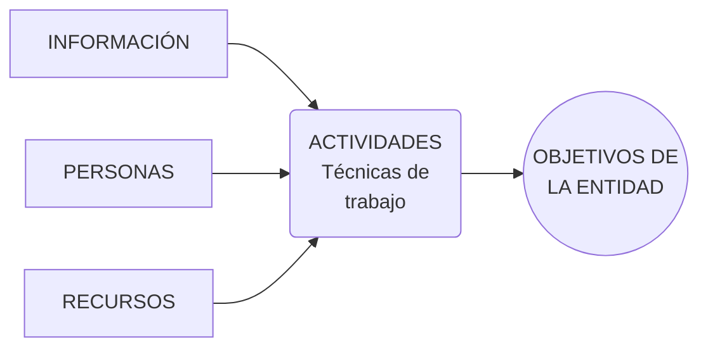

# Unidad X McGrawHill <br> Titulo unidad

```md
# Objetivos
1. Identificar los pilares básicos sobre los que se sustenta la seguridad informática. Conocer los mecanismos básicos de seguridad.
2. Conocer el concepto de vulnerabilidad y sus diferentes tipos. Aplicar técnicas de detección de vulnerabilidades.
3. Conocer el concepto de amenaza, tipos y su clasificación.
4. Conocer los mecanismos de seguridad física y ambiental. Aplicar técnicas de protección contra pérdidas de información, analizando planes de seguridad y necesidades de uso para asegurar los datos.
5. Conocer diferentes políticas de seguridad informática, su necesidad y su aplicación a diferentes entornos.
```

- [Unidad X McGrawHill  Titulo unidad](#unidad-x-mcgrawhill--titulo-unidad)
  - [1. Seguridad Informática: mecanismos básicos de seguridad](#1-seguridad-informática-mecanismos-básicos-de-seguridad)
    - [1.1 Ciberseguridad, seguridad informática y seguridad de la información](#11-ciberseguridad-seguridad-informática-y-seguridad-de-la-información)
    - [1.2 Sistemas de información](#12-sistemas-de-información)
    - [1.3 Sistema de gestión de seguridad de la información (SGSI)](#13-sistema-de-gestión-de-seguridad-de-la-información-sgsi)
    - [1.4 Bases de la seguridad](#14-bases-de-la-seguridad)
    - [1.5 Medidas de seguridad y mecanismos de seguridad](#15-medidas-de-seguridad-y-mecanismos-de-seguridad)
      - [A. Autenticación](#a-autenticación)
      - [B. Autorización](#b-autorización)
      - [C. Administración](#c-administración)
      - [D. Auditoría](#d-auditoría)
      - [E. Registro](#e-registro)
      - [F. Mantenimiento del a integridad de la información](#f-mantenimiento-del-a-integridad-de-la-información)
    - [1.6 Legislación sobre seguridad](#16-legislación-sobre-seguridad)
  - [2. Vulnerabilidades de un sistema informático](#2-vulnerabilidades-de-un-sistema-informático)
    - [2.1 Vulnerabilidad](#21-vulnerabilidad)
    - [2.2 Amenaza](#22-amenaza)
    - [2.3 Análisis de vulnerabilidades](#23-análisis-de-vulnerabilidades)
  - [3. Amenazas (IMIF)](#3-amenazas-imif)
      - [A. Interceptación](#a-interceptación)
      - [B. Modificación](#b-modificación)
      - [C. Interrupción](#c-interrupción)
      - [D. Fabricación](#d-fabricación)
    - [3.1 Clasificación de las amenazas](#31-clasificación-de-las-amenazas)
  - [4. Seguridad física y ambiental. Seguridad Pasiva](#4-seguridad-física-y-ambiental-seguridad-pasiva)
    - [4.1 Ubicacioń y protección física](#41-ubicacioń-y-protección-física)
    - [4.2 Seguridad pasiva](#42-seguridad-pasiva)
      - [A. SAI](#a-sai)
      - [B. Copias de seguridad](#b-copias-de-seguridad)
      - [C. Recuperación de la información](#c-recuperación-de-la-información)
        - [1. Métodos de recuperación lógica](#1-métodos-de-recuperación-lógica)
        - [2. Métodos de recuperación física](#2-métodos-de-recuperación-física)
      - [D. Medios de almacenamiento](#d-medios-de-almacenamiento)
  - [5. Políticas de seguridad](#5-políticas-de-seguridad)


## 1. Seguridad Informática: mecanismos básicos de seguridad

```md
En la actualidad se está generalizando el uso del término “ciberseguridad” como sinónimo de seguridad informática y seguridad de la información, pero esta asociación no es del todo correcta.

Para intentar aclarar las diferencias que existen entre los términos anteriores se van a introducir estos conceptos dando sus definiciones y estableciendo los puntos que marcan esas diferencias. De esta forma, y a lo largo de las diferentes unidades del módulo, haremos un uso adecuado de cada término.

Abordaremos también el concepto de sistema de gestión de seguridad de la información (SGSI), describiremos los pilares básicos sobre los que se sustenta la seguridad informática, así como los mecanismos utilizados para garantizar dicha seguridad.
```

### 1.1 Ciberseguridad, seguridad informática y seguridad de la información

- **Seguridad de la información**: conjunto de medidas preventivas y reactivas, tanto humanas como técnicas, que afectan al almacenamiento y tratamiento de los datos que tienen valor para una organización a través de la reducción de riesgos y mitigando las posibles amenazas
  - Objetivo: prevención riesgos, proteger hardware/software/datos, cnofianza clientes/servicio, marco legal aplicable
  - Ejemplo: políticas de segurida de una organización, BlueTeam...
- **Seguridad informática**: se engloba dentro de la segurida de la información. Su objetivo es proteger la información utilizando solo medios tecnológicos (informáticos y telemáticso), asegurando su almacenamiento, procesado y transmisión
  - Ejemplo: normativas uso cookies, almacenamiento datos de clientes
- **Ciberseguridad**: conjunto de medidas de protección de la información a través del tratamiento de las amenazas que ponen en riesgo la información que es tratada por los sistemas de información que se encuentran interconectados
  - También se engloba dentro de la seguridad de la información.
  - Objetivo: proteger información de ataques maliciosos utilizando técnicas proactivas.
  - Ejemplo: defensa servidores/redes/dispositivos electrónicos mediante prácticas ofensivas, detección de vulnerabilidades, evitar DDoS


### 1.2 Sistemas de información

- **Sistema de información (SI)**: conjunto ordenado de mecanismos cuyo objetivo es administrar datos e información en general, de forma que puedan ser procesados y/o recuperados de forma sencilla y rápida
  - **Recursos**:
    - humanos (personal capacitado)
    - datos (información)
    - procesos (actividades necesarias)
    - tecnológicos (físicos/lógicos ie. hardware/software)
  - **Funcionamiento**:
    - entrada de información (códigosBarras, códigosQR, teclado, cajaRegistradora, sistemaVoz, escáner)
    - procesamiento (...)
    - almacenamiento (persistencia)
    - salida (extraída/enviada red)

<br>



### 1.3 Sistema de gestión de seguridad de la información (SGSI)

- **Sistema de gestión de seguridad de la información (SGSI)**: conjunto de políticas, procedimientos, guías, recursos y actividades asociadas, gestionadas colectivamente por la organización, con la intención de proteger sus activos de información
  - Proceso: identificar los activos, determinar protección según importancia. -- según ISO 27001, ISO 27002, ciclo Deming (`Plan Do Check Act`)
  - *Plan*: establecer contexto
  - *Do*: implementar sistema
  - *Check*: monitorear y revisar
  - *Act*: mantimiento y propuestas de mejora
- La seguridad/riesgos no terminan, ni humanos ni tecnológicos

### 1.4 Bases de la seguridad

- **Fiabilidad**: probabilidad de que un sistema se comporte tal y como se espera de él. Tres aspectos clave:
  - *Confidencialidad*: prevenir la divulgación no autorizada de la información -- encriptación, claves...
  - *Integridad*: prevenir modificaciones no autorizadas de la información -- datos + origen datos
  - *Disponibilidad*: prevenir interrupciones no autorizadas/controladas de los recursos informáticos

### 1.5 Medidas de seguridad y mecanismos de seguridad

- DISTINCIÓN
  - **elemento / activo a proteger**: medidas físicas o lógicas
  - **momento en el que se protege**: medidas activas o pasivas

#### A. Autenticación

- Verificación identidad usuario (conexión a sistema/red/BD/...)
- Métodos según lo que uno:
  - *sabe*: contraseña, PIN, cuestionario...
  - *tiene*: OTP SMS, token RSA, certificado, tarjeta magnética...
  - *es*: huellas digitales, reconomiento facial...
- Se recomienda: `2FA`...

#### B. Autorización

- Proceso determinar qué, cómo y cuándo usuario autenticado utiliza recursos
- Información gestionada por niveles según sensibilidad con autorización correspondiente
- Se recomienda: registrar autorizaciones

#### C. Administración

- Define, mantiene y elimina autorizaciones de usuarios, recursos y relaciones
- Tarea en continuo cambio (tecnología/riesgos)

#### D. Auditoría

- Vigilancia continua de servicios en producción mediante `logs`

#### E. Registro

- Almacenar intentos de violar reglas seguridad
- Monitoreo manual/automático bajo cierta periodicidad

#### F. Mantenimiento del a integridad de la información

- Procedimientos establecidos para evitar o controlar que los archivos sufran cambios no autorizados y que la información enviada desde un punto llegue al destino inalterada
- Técnicas: antivirus, encriptación, funciones `hash`, software de 'Gestión de identidades'

### 1.6 Legislación sobre seguridad

> ...

## 2. Vulnerabilidades de un sistema informático

```md
Introducimos ahora varios conceptos relacionados con la seguridad informática. En primer lugar, el concepto de vulnerabilidad como debilidad del sistema que podría poner en riesgo al propio sistema. Y, en segundo lugar, el concepto de amenaza como acción o suceso que compromete la seguridad del sistema.

Pero lo más importante es la relación entre ambos conceptos. Si un sistema informático no presenta una determinada vulnerabilidad, aunque se presente el escenario o suceso, es decir la amenaza, no tendría ningún impacto sobre él.
```

- **Activos**: hardware, software, datos, otros (fungibles, personas, elementos externos)
- Proceso de transformación de datos: `Dato > Información > Conocimiento > Acción > Resultado > Valor`


### 2.1 Vulnerabilidad

- **Vulnerabilidad**: debilidad de cualquier tipo que compromete la seguridad del sistema informático
  - Agrupación según:
    - *DISEÑO*: protocolos de red, políticas de seguridad, formato, buffer overflow...
    - *IMPLEMENTACIÓN*: errores programación, puertas traseras, descuidos fabricante, accesos remotos / entornos no seguros (`telnet`)
    - *USO*: configuración, desconocimiento/ignorancia, herramientas ofensivas, limitación gubernamental, bloatware
  - `0 days`: no existe solución pero sí **explotación**

> - [ ] https://www.clubdeinnovacion.es/cersti-cert-seguridad-e-industria/

### 2.2 Amenaza

- **Amenaza**: escenario en el que una acción o un suceso, ya sean o no deliberados, comprometen la seguridad de un elemento del sistema informático. Cuando a un sistema informático se le detecta una vulnerabilidad y existe una amenaza asociada a dicha vulnerabilidad, puede ocurrir que el suceso o evento se produzca y el sistema estará en riesgo.
  - Si el evento se produce y el riesgo que era probable ahora es real, el sistema informático sufrirá daños que habrá que valorar cualitativa y cuantitativamente, y esto se llama '*impacto*'
  - AKA: Un evento producido en el sistema informático que constituye una amenaza asociada a una vulnerabilidad del sistema, produce un impacto sobre él

### 2.3 Análisis de vulnerabilidades

- **Observaciones preliminares**: último análisis, frecuencia, mantenerse al tanto de nuevas vulnerabilidades
- **Bases de datos de la comunidad**: https://cve.mitre.org, https://nvd.nist.gov, https://kb.cert.org/vuls


## 3. Amenazas (IMIF)

```md
Conocido el concepto de vulnerabilidad como debilidad del sistema, en este apartado entramos a enumerar diferentes escenarios en los que el sistema informático que presenta cierta vulnerabilidad puede ser amenazado.

Clasificamos las amenazas atendiendo a varios criterios y, de ellos, el más generalista es el que se centra en el factor de seguridad que comprometen: disponibilidad, integridad o confidencialidad.

También se incluyen otros criterios de clasificación atendiendo al origen o intencionalidad de las amenazas, incluyendo algunos ejemplos concretos.
```
- **Amenaza**: toda acción que aprovecha una vulnerabilidad para atentar contra la seguridad de un sistema de información
  - **Ataque**: realización de amenaza con la idea de provocar un impacto
  - Agrupación según naturaleza y factor de seguridad comprometido:

#### A. Interceptación

- Acceso a la información por parte de personas *no autorizadas* (intrusos); uso de privilegios no adquiridos
  - Detección difícil mientras se produce, ya que no deja huellas
  - Se compromete: confidencialidad
  - Ejemplos: copias ilícitas, interceptar datos, interceptar identidad (lectura de cabeceras de paquetes para conocer la identidad del usuario implicado en la comunicación observada ilegalmente)

#### B. Modificación

- El intruso obtiene acceso *no autorizado* a dispositivos o recursos de red con los *privilegios* suficientes para realizar cambios
  - Detección difícil según las circunstancias
  - Se compromete: confidencialidad & integridad
  - Ejemplos: modificación BD, hardware, programa, contenido mensajes transmitidos en red

#### C. Interrupción

- Puede provocar que un objeto del sistema se pierda, quede inutilizable o no disponible
  - Detección inmediata
  - Se compromete: confidencialidad, integridad & disponibilidad
  - Ejemplos: destrucción hardware (disco duro), borrado programas/datos, fallos en OS, deshabilitar línea de comunicación, deshabilitar sistema de gestión de arch

#### D. Fabricación

- De forma no autorizada el intruso inserta objetos falsificados en el sistema. Puede cnosdierarse como un caso concreto de modificacón, ya que se consigue un objeto similar al atacado de forma que no resulte sencillo distinguir entre el objeto original y el fabricado
  - Detección difícil; delitos de falsificación
  - Se compromete: autenticidad o integridad de origen
  - Ejemplos: añadir transacciones en red, registros en BD, mensajes falsos/ilegítimos en red


### 3.1 Clasificación de las amenazas

- **Físicas** (instalación, hardare, controlAcceso) VS **Lógicas** (OS, aplicaciones, datos)
  - Materializan en: personas (internas/externas a org.), programas específicos, catástrofes naturales etc.
- **Según Origen**:
  - *Amenazas naturales*: inundación, incendio, tormenta, fallo eléctrico, explosión
  - *Amenazas de agentes externos*: virus informáticos, ataques de org. criminal, sabotaje terrorista, intrusos en red, robos, estafas
  - *Amenazas de agentes internos*: empleados descuidados con formación inadecuada o descontentos, errores utilización herramientas y recursos del sistema
- **Según Intencionalidad**:
  - *Accidentes*: averías de hardware y fallos de software, incencio, inundación
  - *Errores*: errores de utilización, explotación, ejecución procedimientos
  - *Actuaciones malintencionadas*: robos, fraudes, sabotajes, intentos de intrusión


## 4. Seguridad física y ambiental. Seguridad Pasiva

```md
Analizamos diferentes medidas de seguridad física y ambiental que van a determinar en gran medida el buen funcionamiento del sistema informático, evitando situaciones de riesgo o amenazas.

Conocidas las amenazas de tipo físico y/o ambiental, se pueden aplicar estas medidas intentando minimizar el riesgo o impacto sobre el sistema informático. Pero cuando el incidente de seguridad se ha producido, se deben haber realizado, previamente, acciones que permitan recuperar el sistema informático al estado más próximo posible en el que se encontraba en el momento del incidente, y aquí es donde entra la seguridad pasiva, con las copias de seguridad y los mecanismos de recuperación.
```

- **Seguridad física y ambiental**: conjunto de controles y medidas de seguridad respecto de la ubicación física del sistema informático y eu establecen las normas para evitar accesos no autorizados, daños e interferencias en el sistema de información de la organización
  - Deben permitir acceso a zonas restringidas solamente a personas autorizads + establecer condiciones ambientales adecuadas
  - Ejemplos: control de acceso, detección de intrusos, seguridad de la información, centro de bases de datos, gestión de visitantes y reconocimiento de identidad, getsión de activos, comunicaciones de emergencias, sistemas unificados, sensores y alarmas, video vigilancia
  - Posibles remedios:

| Amenaza                           | Medidas de seguridad
| ---                               | ---
| Incencios                         | Ubicación en área no combustible o inflamable <br> Disponer de sistema contraincendios
| Temperatura y humedad             | Sistema de aire acondicionado
| Inundaciones                      | Controlar la ubicación (estanca de agua)
| Robos                             | Circuito cerrado de TV (CCTV), vigilantes, códigos de seguridad
| Rayos y señales electromagnéticas | Controlar la ubicación y el acondicionamiento físico (jaula de Faraday...)
| Cortes de luz                     | SAI, estabilizadores, grupos electrógenos
| Sobrecargas eléctricas            | SAI profesionales con filtros para evitar picos de tensión
| Terremotos                        | Conocer actividad sísmica de la zona; construcciones antisísmicas


### 4.1 Ubicacioń y protección física

<!-- - Seguridad física: protección hardware -->
- **Ubicación CPD debe**: ser inaccesible para usuarios no autorizados, condiciones geográficas favorables para soportar catástrofes naturales, condiciones ambientales propicias (21º-23º con humedad relativa 45-50%)
  - Tener en cuenta: evitar interferencias radiofrecuencias, evitar maquinaria pesada o almacenees con gas inflamable o nocivo, prevención inundaciones
  - Descartar: zonas cercanas a paredes exteriores, plantas bajas o salas de esperas (sensibles al sabotaje), sótanos (inundaciones), últimas plantas (desastres aéreos), encima de lugares con riesgo de fuego
  - *Se recomiendan*: plantas intermedias o en ubicaciones centrales en parques empresariales

### 4.2 Seguridad pasiva

- **Seguridad pasiva**: conjunto de medidas que la organización aplica después de producirse el incidente de seguridadm intentando siempre minimizar el impacto que pueda tener sobre el sistema informático
  - Objetivo: recuperar el sistema al estado anterior al incidente
  - Medidas destacadas:

| Medida                                    | Cómo se minimiza el impacto
| ---                                       | ---
| RAID                                      | Restaura la información de los otros discos duros
| Sistemas de archivos tolerantes a fallos  | Previenen posibles incosistencias en los datos
| SAI/UPS                                   | Suministra energía al sistema
| Copias de seguridad                       | Recupera la información en caso de pérdida o robo
| Extintores, muros y paredes cortafuegos   | Minimiza y palia los daños provocados por un incendio


#### A. SAI

- **Sistemas de alimentación ininterrumpida (SAI/UPS)**: capaces de proporcionar corriente eléctrica a partir de un acumulador o de otra forma de energía (mecánica o de combustión)
  - *Otras funciones*: mejorar la calidad de la energía eléctrica filtrando las subidas y bajadas de tensión
  - *Usos*: equipos críticos médicos, industriales o informáticos
  - *Valor*: el suministro se garantiza a base de convertir la corriente continua de [dicha batería] en una corriente alterna de las mismas características que la red comercial
  - **Objetivos**: regular corriente eléctrica & proporcionar energía eléctrica continua
  - *Componentes*: rectificador (alterna>continua), baterías, convertidor (continua>alterna)
  - *Clasificación*:
    - **OFFLINE/STANDBY**: popular, equipos domésticos; tiempo entre incidente y funcionamiento; bajo coste, corriente no de gran calidad
    - **ONLINE**: más completo, sin tiempo de conmutación; entornos industriales, 'se caracteriza porque se intercala entre el suministro de la red normal y la carga que se quiere alimentar'; proporciona aislamiento
    - **SAI INTERACTIVO / INLINE**: como offline pero dispone de filtros activos que estabilizan la tensión de entrada; pequeños comercios o empresas; tiempo de conmutación inapreciable (ok)

#### B. Copias de seguridad

- **Copias de seguridad (backup)**: duplicado que se realiza sobre archivos o aplicaciones contenidas en un equipo con la finalidad de poder recuperarlos en el caso de que el sistema de información sufra daños o pérdidas accidentales de los datos almacenados
  - *Posibilidades*: realizar copias de archivos y directorios del disco duro, de datos del estado del sistema (registro, AD, BD certificados), automatización, restauración
  - Garantizan Integridad  & Disponibilidad; mecanismos: cintas magnéticas, discos duros, servidores externos cloud

#### C. Recuperación de la información

- **Recuperación de datos**: conjunto de técnicas que [aplicadas a un dispositivo de almacenamiento dañaado] tienen como objetivo extraer toda la información posible; en muchas ocasiones implica una destrucción total del dispositivo de almacenamiento
  - **Motivos pérdida información**: dispositivo dañado, corrupción 'lista de archivos', datos sobreescritos...
  - Clasificación:

##### 1. Métodos de recuperación lógica

- *Uso*: cuando todos los componentes funcionan correctamente y, por tanto, se puede acceder a todos y cadas uno de los sectores en los que se almacena la información
- *Diagnóstico*: si se ha perdido el acceso a los datos, podrá ser debido a que (1) alguna parte de la estructura del sistema de archivos está dañada, (2) algún archivo ha sido borrado con los comandos del sistema y por tanto no aparece en la 'lista de archivos'
- *Funcionamiento*: la recuperación lógica de datos analiza la estructura de archivos que permanece, identifica el daño producido y permite acceder a los datos que aún están en el dispositivo
- *Resultado*: en algunos casos se pueden recuperar los datos identificativos del archivo (nombre, extensión, tamaño, fecha de creación) y en otros solo el contenido del mismo
- *Herramientas en Windows*:
  - `DISM`: `CheckHealth`, `ScanHealth`, `RestoreHealth`; repara archivos corruptos en base a una imagen de recuperación
  - `CHKDSK`: analizar estructura de datos y reparar los daños detectados
  - `SFC`: comprobar el estado de los archivos del sistema; objetivo es detectar daños o errores e intentar solucionarlos
  - De terceros: Recuva, Recoverit, SPWDR
- *Herramientas en Linux*: `fsck` (verificar la consistencia del sistema de archivos desmontándolo), GNU DDRescue-GUI, TestDisk, PhotoRec

##### 2. Métodos de recuperación física

- ...
- **Destruir información pro seguridad**: método Gutmann (sobreescritura)

#### D. Medios de almacenamiento 

- Opciones de almacenamiento seguro:
  - *Tipo de sistemas de archivos*: primer nivel de protección; debe soportar ACL; cada objeto tiene un propietario y el resto de los usuarios tiene un acceso definido por él
  - Utilización de la **encriptación**:
     - *Aplicaciones de cifrado*: algoritmos de cifrado simétrico; proceso lento; ejemplos (PGP, Bitlocker)
     - *Sistemas de archivos cifrados*: algoritmos de cifrado simétrico; se cifra todo; compaginar seguridad+transparencia; ejemplos (CFS, TCFS, EFS)
     - *Copias cifradas*: seguridad copias igual que la de los datos originales; almacenamiento y recuperación elntas; garantizar casos extremos


## 5. Políticas de seguridad

```md
Como consecuencia de todas las amenazas y riesgos a los que están sometidos los recursos del sistema informático, se hace necesario establecer una serie de normas dentro de la organización que proporcionen las medidas y procedimientos necesarios para intentar evitar o minimizar el impacto que un ataque tendría sobre ellos.

Y aquí es donde la norma **ISO 27001** nos ayuda, ya que establece los requisitos necesarios para implantar, mantener y mejorar el sistema de gestión de la seguridad de la información, conocido como **PDCA** (Plan, Do, Check, Act, planificar, hacer, verificar, actuar), y que estudiamos en el primer apartado.
```

- **Política de seguridad informática (PSI)**: documento sencillo que define las directrices organizativas en materia de seguridad
  - *Objetivos*: mostrar el posicionamiento de la org. con relación a la seguridad & servidr de base para desarrollar los procedimientos/mecanismos concretos de seguridad & asumir la normativa y leyes vigentes
  - *Se definen los QUÉ (no los CÓMO)*: qué debe ser protegido, qué es lo más importante/prioritario, qué está permitido y qué no, qué tratamiento se les dará a los problemas de seguridad
  - *Elaboración*: políticas/prácticas adoptadas por la compañía, revisadas y actualizadas periódicamente
  - *Deben*: definir SI y objetivos; requerir compromiso de cargos altos/bajos; establecer normas para acceso a datos; responsabilidades, establecer base para diseñar normas y procedimientos (datos, personas, contingencia, prevención y detección malware, admon. equipos)
  - *Etapas implementación*: (1) identificar necesidades, riesgos y consecuencias, (2) perspectiva general defensa, (3) controlar y detectar vulnerabilidades, (4) definir acciones a realizar y personas responsables
  - *Resultados*: formación usuarios, mecanismos físicos y lógicos, procedimiento admon. actualizaciones, planificación backups, plan de recuperación, sitema documentado actualizado
  - *Normativa*: `ISO 27001`
- **EJEMPLO**
  - *Clasificación datos*: confidencial, uso restringido, uso interno, uso público
  - *Perspectivas*: confidencialidad, sensibilidad integridad, sensibilidad disponibilidad
  - INCIBE > PYMES
