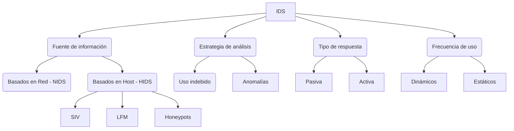

# Unidad 3 McGrawHill <br> Seguridad Activa

```md
# Objetivos
1. Conocer el concepto de ataque informático y las contramedidas que se pueden adoptar, así como la clasificación de los ataques.
2. Diferenciar entre tipos de malware, sus características y formas de actuar.
3. Conocer cómo es la anatomía de un ataque informático y cómo se realiza su análisis.
4. Comprender la necesidad de establecer buenas prácticas informáticas como herramienta preventiva de cualquier ataque.
5. Aprender a utilizar herramientas paliativas.
```

- [Unidad 3 McGrawHill  Seguridad Activa](#unidad-3-mcgrawhill--seguridad-activa)
  - [1. Ataques. Clasificación](#1-ataques-clasificación)
    - [1.1 Tipos de ataques](#11-tipos-de-ataques)
      - [A. Ataques pasivos](#a-ataques-pasivos)
      - [B. Ataques activos](#b-ataques-activos)
    - [1.2 Diferencias entre ataques activos y pasivos](#12-diferencias-entre-ataques-activos-y-pasivos)
  - [2. Malware](#2-malware)
    - [2.1 Malware infeccioso](#21-malware-infeccioso)
      - [A. Virus](#a-virus)
      - [B. Gusano](#b-gusano)
    - [2.2 Malware oculto](#22-malware-oculto)
      - [A. Fantasmas (drive-by downloads)](#a-fantasmas-drive-by-downloads)
      - [B. Puertas traseras (backdoors)](#b-puertas-traseras-backdoors)
      - [C. Troyanos](#c-troyanos)
      - [D. Rootkits](#d-rootkits)
    - [2.3 Malware para obtener beneficio](#23-malware-para-obtener-beneficio)
      - [Mostrar publicidad: Spyware, Adware y Hijacking](#mostrar-publicidad-spyware-adware-y-hijacking)
    - [2.4 Ataques distribuidos: botnets (redes zombie)](#24-ataques-distribuidos-botnets-redes-zombie)
  - [3. Anatomía de ataques y análisis de software malicioso](#3-anatomía-de-ataques-y-análisis-de-software-malicioso)
    - [Contramedidas para cada fase del ataque](#contramedidas-para-cada-fase-del-ataque)
      - [A. Reconocimiento y Exploración (fases 1 y 2)](#a-reconocimiento-y-exploración-fases-1-y-2)
      - [B. Acceso (fase 3)](#b-acceso-fase-3)
      - [C. Persistencia y expansión (fase 4)](#c-persistencia-y-expansión-fase-4)
      - [D. Logro del objetivo (fase 4)](#d-logro-del-objetivo-fase-4)
      - [E. Borrado de huellas (fase 5)](#e-borrado-de-huellas-fase-5)
  - [4. Herramientas preventivas. Pautas y prácticas seguras](#4-herramientas-preventivas-pautas-y-prácticas-seguras)
    - [4.1 Mantener actualizado el sistema operativo y las aplicaciones](#41-mantener-actualizado-el-sistema-operativo-y-las-aplicaciones)
    - [4.2 Aseguramiento o endurecimiento (hardening) del sistema operativo](#42-aseguramiento-o-endurecimiento-hardening-del-sistema-operativo)
    - [4.3 Protección en el correo electrónico](#43-protección-en-el-correo-electrónico)
    - [4.4 Seguridad en la navegación web](#44-seguridad-en-la-navegación-web)
    - [4.5 Seguridad en las redes sociales](#45-seguridad-en-las-redes-sociales)
    - [4.6 Seguridad en las redes P2P](#46-seguridad-en-las-redes-p2p)
    - [4.7 Seguridad en la mensajería instantánea](#47-seguridad-en-la-mensajería-instantánea)
    - [4.8 Seguridad en los dispositivos extraíbles](#48-seguridad-en-los-dispositivos-extraíbles)
  - [5. Herramientas paliativas](#5-herramientas-paliativas)
    - [Sistemas de Detección de Intrusos (IDS)](#sistemas-de-detección-de-intrusos-ids)
      - [A. Host IDS](#a-host-ids)
      - [B. Network IDS](#b-network-ids)
      - [C. Sistemas de Protección de Intrusos (IPS)](#c-sistemas-de-protección-de-intrusos-ips)


## 1. Ataques. Clasificación

```md
La unidad estudia los mecanismos de seguridad activa y, en concreto, en este apartado se centra en los ataques, sus diferentes tipos y sus características.
Se explican las diferentes motivaciones de los atacantes, que pueden ser desde intentos inofensivos hasta ataques activos organizados utilizando información obtenida a través de los ataques pasivos.
Se incluyen otras clasificaciones de los ataques, menos conocidas pero no por ello menos importantes; es el caso de los ataques internos y externos, de ellos, los internos son de especial importancia, ya que se producen desde dentro de la organización y, por lo tanto, desde una posición de privilegio.
```

- **Seguridad activa**: tiene como objetivo proteger y evitar posibles daños en los sistemas informáticos
  - Mecanismos: contraseñas, software de detección intrusiones, encriptación
- **Amenaza**: escenario en el que una acción o suceso, ya sea o no deliberado, compromete la seguridad de un elemento del sistema informático. Ataque == realización amenaza
- **Motivaciones atacantes**: MICE: Money, Ideology, Compromise, Ego

### 1.1 Tipos de ataques

#### A. Ataques pasivos

- "En los ataques pasivos, el atacante no altera la comunicación, únicamente escucha, registra o monitoriza el uso de los recursos y/o accede a la información guardada o transmitida por el sistema"
- Ejemplos: obtener origen|destinatario comunicaciones (leyendo cabeceras de paquetes), volumen de tráfico, horas habituales de intercambio de datos
- **Difíciles de detectar, solo se puede prevenir. Es una buena práctica presuponer que alguien está a la escucha de todo lo que se envía por internet**

#### B. Ataques activos

- "Los ataque activos producen cambios en el flujo de datos, pueden crear un falso flujo de datos o modificar la situación de los recursos del sistema"
- 4 categorías:
  - **Suplantación de identidad**: robar login, phising
  - **Ataques criptográficos**: adivinar o robar contraseñas, descifrar datos cifrados
  - **Modificación de los mensajes**: ...
  - **Degradación fraudulenta del servicio**: suprimir mensajes a X, DDoS
- Otras clasificaciones según:
  - **Origen**: externo VS interno
  - **Complejidad**: no estructurado VS estructurado

### 1.2 Diferencias entre ataques activos y pasivos

| Ataque activo                                             | Ataque pasivo
| ---                                                       | ---
| Hay modific. información                                  | No hay modific. información
| Amenaza para integrid. y disponib.                        | Amenaza para confidencialidad
| Atención en detección                                     | Atencioń en evitar daño
| Sistema de daña permanentemente                           | No hay daño al sistema
| Se notifica a la víctima o esta se percata                | La víctima no se percata
| Los recursos del sistema se modific.                      | Los recursos no se modific.
| Tiene impacto en servicios del sistema                    | Recopila info del sistema o la red
| Utiliza info recopilada en ataq. pasivos                  | Recopila info como contraseñas y mensajes
| Técnicas agresivas para controlar entrada a sist. o redes | Fácil de prevenir


## 2. Malware

```md
Estudiamos el malware o software malicioso, en sus diferentes versiones o acepciones, así como sus objetivos, que básicamente son tres: robo de información, secuestro del equipo o de los datos del sistema e incorporación del equipo en una red de bots. En la mayoría de los casos, el móvil para realizar dicha intrusión es económico.
En general, el malware se ejecuta sin el conocimiento ni autorización del propietario o usuario del equipo infectado y realiza funciones en el sistema que son perjudiciales para el usuario y/o para el sistema.
```

- **Malware**: programa informático cuya principal característica es que se ejecuta sin el conocimiento ni autorización del propietario o usuario del equipo infectado y realiza funciones en el sistema que son perjudiciales para el usuario y/o para el sistema
- Tipos (cada uno tendrá sus propios métodos de réplica|infección|transmisión)
  - *malware infeccioso*: virus y gusanos
  - *malware oculto*: troyanos y puertas traseras
  - *malware para obtener algún tipo de beneficio*: adware

> doc tabla 'Clasificación_Malware.pdf'

- Análisis de malware en *sandbox* environments:
  - **Estático**: analizar el código sin ejecutarlo (LOW LEVEL), ingeniería inversa
  - **Dinámico**: ejecución y monitorización de procesos|conexiones en *sandbox* para 
  - **Programas anti-malware**: 2 formas de protección
    - <u>Protección en tiempo real contra instalaciones</u>: se escanean todos los datos de la red (descargas) en busca de malware y bloquea positivos <!--; en algunos casos puede interceptar intentos de ejecución automática al arrancar el sistema o modificaciones en el navegador web-->
    - <u>Detección y eliminación de malware ya instalado</u>: escanean el Windows Registry, archivos del sistema, memoria, programas instalados; generalmente <b>exploits del navegador web</b>...


### 2.1 Malware infeccioso
#### A. Virus

- Programas que infectan otros programas o archivos (víctimas) para tomar el control al ser ejecutados
- Replicar (entidad propia) != infectar (adhiere a archivo infectado)
- 1972, Creeper, IBM 360 > antivirus Reaper
- **Objetivo**: infectar provocando un mal funcionamiento del ordenador, sin conocimiento por parte del usuario
- <u>Proceso de infección</u>: ejecución programa infectado > código en RAM > virus toma en control de servicios del OS > infecta otros ejectuables en RAM > persistencia código malicioso
- 'Normalmente los virus crean un acceso directo a sí mismos para ser ejecutados al arranque

> doc 'Virus_Antivirus.pdf'

#### B. Gusano

- **Gusanos**: Utilizan los recursos de la red para replicarse y distribuirse; su objetivo es replicarse hasta saturar los recursos del sistema (eg. DDoS)
- No necesitan interacción del usuario, se distribuyen por la red (gran consumo ancho de banda)
- <u>Ejemplos</u>: Morris (1988), ILOVEYOU (2000), SQL Slammer (2003), WannaCry (2017)

### 2.2 Malware oculto
#### A. Fantasmas (drive-by downloads)

- **Fantasmas**: Descargas de algún tipo de malware que se hace sin consentimiento del usuario y sin que este se percate de ello <!--Cuidado: pop-ups, spyware, ...-->
- Objetivos: instalar spyware, filtrar datos, acceder a otros sitemas|redes|cuentas, integrar dispositivo en botnet (DDoS, criptominería...), ransomware, adware

#### B. Puertas traseras (backdoors)

- **Backdoor**: Cualquier método utilizado para eludir los procedimientos habituales de autenticación al conectarse a una máquina; permite acceder de forma remota al equipo víctima ignorando los mecanismos de autenticación, facilitando así la entrada a la información del usuario sin su conocimiento
- Ejemplos: rootkits, troyanos, spyware, cryptojackers, keyloggers, gusanos, ransomware
- <u>Vulnerabilidades</u>: puertos abiertos, contraseñas débiles, software obsoleto, cortafuegos débiles, ingeniería social
- Características: invisibles para el usuario, ejecución silenciosa desde el arranque, potencial acceso total a las funciones de la máquina víctima, difícil eliminar del sistema (pueden están en cualquier sitio)
- Ejemplos: DUAL_EC (2013), Cryptojacker DoublePulsar (2017)

#### C. Troyanos

- **Troyanos**: Malware con apariencia de ser inofensivo o atractivo, que invita al usuario a ejecutarlo pero que esconde código malicioso que permite la administración remota de una máquina de forma oculta
- En la actualidad, el uso de troyanos se orienta hacia el robo de datos bancarios o información personal

#### D. Rootkits

- **Rootkits**: malware que permite el acceso con privilegios y continuado a una máquina remota de forma oculta al control de sus administradores
- Modifican el OS víctima para permanecer oculto (ocultar procesos|archivos)
- Intrusión (vuln|crack) > Rootkit
- 'La detección del rootkit es muy difícil, ya que es capaz de corromper el programa que debería detectarlo. A menudo eliminar el rootkit es prácticamente imposible, especialmente en los casos en los que el rootkit reside en el kernel. En estos casos la única solución es reinstalar el sistema operativo'

### 2.3 Malware para obtener beneficio
#### Mostrar publicidad: Spyware, Adware y Hijacking

- **Spyware**:
  - malware utilizado para recopilar información (tráfico web, direcciones email) y distribuirla a agencias de publicidad etc.
  - instalados como troyanos o con la 'autorización' del usuario
- **Adware**:
  - muestra publicidad de forma intrusiva en forma de pop-ups etc
- **Hijacking**:
  - malware que realiza cambios en la configuración del navegador web (secuestro)
  - cambios en página de inicio, redireccionamiento resultados búsqueda (posible phishing); modificar redirección DNS
- **Keyloggers & stealers**:
  - programas maliciosos creados para robar información sensible
  - pulsaciones de teclado (eg. PIN tarjeta crédito) & contraseñas recordadas

### 2.4 Ataques distribuidos: botnets (redes zombie)

- **Botnet**: término que hace referencia a un conjunto de robots informáticos que se ejecutan de manera autónoma y automática
- Redes usadas para envío masivo de spam o lanzar ataques DDoS; equipo infectado se loguea en canal de IRC para recibir <u>instrucciones</u> & <u>actualizaciones</u> del malware instalado


## 3. Anatomía de ataques y análisis de software malicioso

```md
Hacemos ahora un análisis general del ataque. Suponemos que se ha materializado la amenaza sobre el sistema informático y describimos los pasos habituales del ataque.
Consta de diferentes fases y en cada una de ellas el intruso realiza una serie de acciones valiéndose de información obtenida a través de Internet o de comandos generales de libre disposición. Utiliza herramientas que exploten vulnerabilidades detectadas en el sistema informático o mecanismos de ingeniería social.
Para cada fase se incluyen algunos mecanismos, a modo de contramedidas, para intentar evitar el ataque o paliar sus efectos.
```

- **FASES DE UN ATAQUE**:
  1. **Reconocimiento: descubrimiento y exploración de sistemas**: OSINT, ingeniería social, dumpster diving, sniffing
  2. **Búsqueda de vulnerabilidades**: sondear al blanco: direcciones IP, nombres de host, servidores DNS, datos de autenticación... (mapeadores de red/puertos, escaneadores de vulnerabilidades)
  3. **Obtener acceso**: explotación de vulnerabilidades: Buffer Overflow, DDoS, Password filtering, Session hijacking (TCP)
  4. **Mantener el acceso**: nuevas cuentas con privilegios, backdoors, rootkits, troyanos...
  5. **Borrar huellas**: eliminar logs y alarmas de IDS


### Contramedidas para cada fase del ataque

#### A. Reconocimiento y Exploración (fases 1 y 2)

- VECTORES DE ATAQUE
  - nombre objetivo > `whois dominio.com`
  - servidores > `nslookup dominio.com` > `traceroute dominio.com`
  - capturación paquetes > `dsniff`, `ethercap`, `wireshark`
  - puertos > `nmap dominio.com`
- CONTRAMEDIDAS
  - Restringir info que se difunde a través de los servicios de DNS y whois
  - Fitlrar paquetes para evitar la detección de la plataforma y los servicios. Barrera ue impida paquetes ICMP echo.
  - Instalar un IDS (Intrusion Detection System) para detectar escaneos de puertos


#### B. Acceso (fase 3)

- VECTORES DE ATAQUE
  - Explotación de vulnerabilidades para la ejecución de código arbitrario
  - Robo de contraseñas: eavesdroping, crackeado (`john`)
  - Servicios mal configurados
  - Troyanos y puertas traseras (`BackOrifice` `NetBus` `SubSeven`)
- CONTRAMEDIDAS
  - Actualización constante del software
  - Política de contraseñas robusta
  - Detección de ping (`Scanlogd` `Courtney` `Ippl` `Protolog`)
  - Revisión periódica de config. servicios
  - Config. adecuada de los routers (ACL...)
  - Desconectar servicios inútiles o peligrosos
  - Cortafuegos, detección de rastreo (`TinyWall` `BlackICE` `ZoneAlarm`)
  - Realizar auditorías
  - Revisión constante de logs

#### C. Persistencia y expansión (fase 4)

- CONTRAMEDIDAS PERSISTENCIA
  - Es complicado evitar la copia de archivos, pero puede detectarse la modificación de estos
  - Existen herramientas que crean un hash de los archivos de sistema y avisan al administrador en caso de detectar una modificación (`TripWire`, `HashCheck`)
- CONTRAMEDIDAS EXPANSIÓN
  - El filtrado de paquetes, los sitemas IDS y el control periódico de los archivos de log
  - Herramientas de monitorización de logs: `Swatch`, `Logcheck`, `EventLog Analyzer`

#### D. Logro del objetivo (fase 4)

- ACCIONES DEL ADVERSARIO
  - Desaparecer sin dejar rastro
  - Avisar al admin. de que se ha entrado en el sistema
  - Comentar los fallos de seguridad encontrados a sus colegas
  - Hacer públicos los fallos de seguridad
  - Hacer chantaje

#### E. Borrado de huellas (fase 5)

- ACCIONES DEL ADVERSARIO
  - Limpieza de logs (eg. histórico de comandos `~/.bash_history`)
  - Borrar caché y cookies del navegador web
  - Ocultar o desinstalar las herramientas utilizadas
  - Eliminar todo rastro de exploits, webshells, sniffers, backdoors...
  - Modificar/eliminar archivos de auditoría o logs del sistema (Windows: *Visor de eventos*)
- CONTRAMEDIDAS
  - Gestión de históricos y monitorización, a nivel de red y a nivel de host
  - 'Para evitar que un intruso elimine los archivos de log se puede optar por mantenerlos guardados fuera del lugar en el que se generan, donde no tengan privilegios y queden guardados para analizarlos'
  - Control del software instalado. Solo instalar lo imprescindible y necesario para trabajar en cada equipo


## 4. Herramientas preventivas. Pautas y prácticas seguras

```md
En relación con la protección contra el malware, las medidas preventivas adquieren un importante significado. Antes de que se produzca el ataque, se deben tomar cuantas precauciones sean necesarias y viables para garantizar la seguridad del sistema informático.
Siempre es preferible proteger frente a reparar desastres. Y en el caso concreto de los sistemas informáticos y sus componentes, las medidas preventivas pueden evitar o disuadir de posibles ataques que dañarían el sistema o provocarían la pérdida de datos.
Describimos diferentes medidas de buenas prácticas, agrupadas por funcionalidades disponibles en el sistema, e insistimos en la necesidad de conocerlas y aplicarlas.
```

- **Objetivo**: Evitar que el software malicioso se instale en el sistema informático
- Necesidad de que los <u>usuarios</u> sigan buenas prácticsa y prevenir amenazas.

### 4.1 Mantener actualizado el sistema operativo y las aplicaciones

- Última versión estable disponible (especialmente si parches de seguridad), siempre por medios seguros o de confianza

### 4.2 Aseguramiento o endurecimiento (hardening) del sistema operativo

- Deshabilitar carpetas compartidas, usar contraseñas fuertes, usuarios con privilegios restringidos, deshabilitar ejecución automática de USBs, visualizar archivos ocultos, mostrar extensiones de archivos

### 4.3 Protección en el correo electrónico

...

### 4.4 Seguridad en la navegación web

- Evitar sitios webs con contenido crackeado, descargar software del sitio oficial, leer políticas de privacidad, mejor pocos complementos, instalar antivirus proactivo (Bitdefender, ESET, Sophos), cortafuegos personal (...), precaución en wifis públicas.

### 4.5 Seguridad en las redes sociales  

- Lo obvio.

### 4.6 Seguridad en las redes P2P

- Explorar con un antivirus todos los archivos que se descargan a través de esta red, sin importar su exten- sión.
- Evitar el almacenamiento de información confidencial y sensible en el mismo equipo en el que se compar- ten archivos por redes P2P, para evitar que sea robada.
- Verificar que el programa cliente de intercambio de archivos no instale o descargue componentes extras, ya que en la mayoría de los casos son malware del tipo adware/spyware.
- Controlar que exista coherencia entre el tamaño original del archivo descargado y el tamaño aproximado que debería tener, para descartar la posibilidad de que haya programas troyanos.
- Chequear que la carpeta de intercambio de archivos solo contenga los archivos que se quieren compartir.
- Revisar la configuración de seguridad del programa cliente; esto ayuda a maximizar la seguridad durante el proceso de descarga de archivos.

### 4.7 Seguridad en la mensajería instantánea

- Lo obvio.

### 4.8 Seguridad en los dispositivos extraíbles


Los dispositivos de almacenamiento extraíbles que se conectan a través del puerto USB (memorias, cámaras digitales, teléfonos móviles, entre otros) son otro foco de propagación/infección de malware.
Es importante tener en cuenta las siguientes medidas que ayudan a mantener el entorno de información con un nivel adecuado de seguridad:
- Establecer políticas que definan el uso correcto de dispositivos de almacenamiento extraibles.
- Ofrecer un acceso limitado y controlado a los usuarios que utilizan estos dispositivos.
- En último extremo es recomendable bloquear, por medio de políticas de grupo, de dominio o corporativas, el uso de estos dispositivos.
- Si se transporta información confidencial en estos dispositivos, es recomendable cifrarla. De esta forma, en caso de robo o extravío, la información no podrá ser vista por terceros.
- Utilizar un antivirus proactivo. Explorar con el antivirus cualquier dispositivo que se conecte al ordenador para controlar a tiempo una posible infección.
- Deshabilitar la ejecución automática de dispositivos en los sistemas operativos Microsoft Windows. Gran parte del malware aprovecha la funcionalidad de ejecución automática de dispositivos de las plataformas Microsoft para propagarse a través de un archivo Autorun.inf.

## 5. Herramientas paliativas

```md
Las medidas preventivas vistas apelan en primer lugar al sentido común del administrador del sistema y a los usuarios en general. Son medidas lógicas pero que, en último extremo, no serían capaces de evitar completamente el ataque. 
Ahora, a esas medidas le añadimos un grupo de herramientas cuyo objetivo es bloquear los accesos no deseados programando alertas para cuando se detecte algo extraño en el sistema.
Son herramientas que incluyen algunas técnicas ya descritas, como son la encriptación y el antimalware. Además, proporcionan sistemas de detección y prevención de intrusiones, sin olvidar la utilización del cortafuegos como barrera de acceso desde Internet a nuestra Intranet.
```

- **Objetivo**: Evitar los daños provocados por el software malicioso a través de conexiones no deseadas (<u>mediante alertas</u>)

### Sistemas de Detección de Intrusos (IDS)

- Un sistema IDS recoge y analiza información procedente de distintas áreas de un equipo o red para identificar posibles fallos de seguridad
  - Fuentes de datos (interfaces de red, logs) > Filtros y patrones > Generación de alarmas (SMS, email)



#### A. Host IDS

- Supervisa dispositivos independientes para analizar paquetes de datos entrantes y salientes y compara las instantáneas actuales con las tomadas anteriormente para comprobar si se han eliminado o modificado
  - Generalmente monitorizar archivos sensibles periódicamente
  - Generación de alarmas ante eventos <!-- Positivo/Negativo y Verdadero/Falso-->
  - Herramientas: `TripWire`, `Aide`

#### B. Network IDS

- Analiza todos los paquetes y busca patrones sospechosos sin suponer una gran carga de tráfico
  - 'A menudo, cuando el HIDS notifica una intrusión puede ser demasiado tarde. El intruso ya está dentro'
  - 'Los NIDS intentan detectar el tráfico de red del "ataque" en curso y lo notifican'
  - Herramienta: `SmoothSec`/`Snortque` (sniffer de paquetes)

#### C. Sistemas de Protección de Intrusos (IPS)

    IPS = IDS + cortafuegos

- IDS identifica pero no remedia. 'Los IPS emiten alarmas y pueden descartar paquetes y desconectar conexiones'
- **Mecanismos**: detección basada en firmas (malware conocido), detección de análisis de protocolo con estado (según actividades aceptadas predefinidas), detección basada en anomalías (posibles falsos positivos)
- "... si encuentra algún paquete sospechoso, el IPS puede bloquear el acceso a la red o aplicación al usuario sospechoso o dirección IP, finalizar su sesión TCP, reconfigurar el cortafuegos o eliminar el contenido malicioso si permanece después del ataque" (inútil frente a DDoS)
- **Heramientas**: `OSSEC` y `Zeek Bro`

