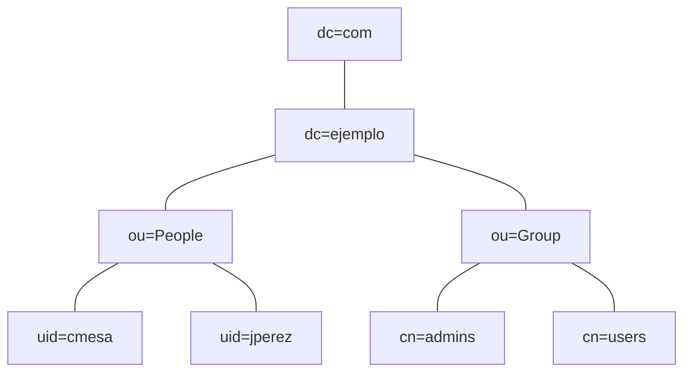

# Unidad 5 McGrawHill <br> Admon. servicio directorio OpenLDAP

```md
# Objetivos
1. Conocer lo que es un directorio activo LDAP.
2. Poner en marcha un directorio activo OpenLDAP.
3. Unir los clientes Linux a un directorio activo OpenLDAP.
```

- [Unidad 5 McGrawHill  Admon. servicio directorio OpenLDAP](#unidad-5-mcgrawhill--admon-servicio-directorio-openldap)
  - [1. Servidor LDAP o directorio activo](#1-servidor-ldap-o-directorio-activo)
    - [1.1 Introducción](#11-introducción)
    - [1.2 Características de LDAP](#12-características-de-ldap)
      - [A. Ventajas de LDAP](#a-ventajas-de-ldap)
      - [B. Arquitectura cliente-servidor](#b-arquitectura-cliente-servidor)
      - [C. Funcionamiento de LDAP](#c-funcionamiento-de-ldap)
    - [1.3 Esquemas de jerarquía](#13-esquemas-de-jerarquía)
      - [A. Elementos y sintaxis del árbol](#a-elementos-y-sintaxis-del-árbol)
        - [Entrada](#entrada)
        - [Atributos](#atributos)
        - [Esquemas](#esquemas)
    - [1.4 Modelo funcional](#14-modelo-funcional)
    - [1.4 El LDAP no trabaja en solitario: + NSS + PAM](#14-el-ldap-no-trabaja-en-solitario--nss--pam)
      - [A. NSS](#a-nss)
      - [B. PAM](#b-pam)
  - [2. Instalación, configuración y mantenimiento del directorio activo](#2-instalación-configuración-y-mantenimiento-del-directorio-activo)
    - [2.1 Introducción](#21-introducción)
    - [2.2 Escenario de ejemplo](#22-escenario-de-ejemplo)
    - [2.3 Requisitos previos](#23-requisitos-previos)
      - [A. Configuración del nombre de la máquina y el dominio](#a-configuración-del-nombre-de-la-máquina-y-el-dominio)
      - [B. Configuracioń de la red, dirección IP](#b-configuracioń-de-la-red-dirección-ip)
    - [2.4 Instalación del software](#24-instalación-del-software)
      - [A. Verificación de la instalación](#a-verificación-de-la-instalación)
      - [B. Configuración del servicio de directorio](#b-configuración-del-servicio-de-directorio)
      - [C. Utilidades proporcionadas por *slapd*](#c-utilidades-proporcionadas-por-slapd)
      - [D. Utilidades proporcionadas por *LDAP-UTILS*](#d-utilidades-proporcionadas-por-ldap-utils)
    - [2.5 Creación de unidades organizativas, grupos y usuarios](#25-creación-de-unidades-organizativas-grupos-y-usuarios)
      - [A. Creación de unidades organizativas](#a-creación-de-unidades-organizativas)
      - [B. Creación de grupos](#b-creación-de-grupos)
      - [C. Creación de usuarios](#c-creación-de-usuarios)
    - [2.6 Búsquedas en los directorios](#26-búsquedas-en-los-directorios)
      - [A. GID de un usuario concreto](#a-gid-de-un-usuario-concreto)
      - [B. Consulta del atributo CN en todo el directorio](#b-consulta-del-atributo-cn-en-todo-el-directorio)
      - [C. Consulta de un objeto concreto](#c-consulta-de-un-objeto-concreto)
      - [D. Consultas con operadores lógicos](#d-consultas-con-operadores-lógicos)
      - [E. Eliminación de un usuario](#e-eliminación-de-un-usuario)
    - [2.7 Administrar el dominio con la herramienta gráfica LAMP (LDAP Account Manager)](#27-administrar-el-dominio-con-la-herramienta-gráfica-lamp-ldap-account-manager)
  - [3. Configuración de los clientes Linux para ser unidos al dominio LDAP](#3-configuración-de-los-clientes-linux-para-ser-unidos-al-dominio-ldap)
    - [3.1 Introducción](#31-introducción)
    - [3.2 Pasos previos](#32-pasos-previos)
      - [A. Configuración del nombre de la máquina y del dominio](#a-configuración-del-nombre-de-la-máquina-y-del-dominio)
      - [B. Configuración de la red, dirección IP](#b-configuración-de-la-red-dirección-ip)
    - [3.3 Instalación del software](#33-instalación-del-software)
    - [3.4 Revisión de la configuración](#34-revisión-de-la-configuración)
      - [A. Fichero de configuración `/etc/ldap.conf`](#a-fichero-de-configuración-etcldapconf)
      - [B. Fichero de configuración `/etc/nsswitch.conf`](#b-fichero-de-configuración-etcnsswitchconf)
      - [C. Comando `pam-auth-update`](#c-comando-pam-auth-update)
    - [3.5 Inicio de sesión gráfica](#35-inicio-de-sesión-gráfica)
      - [A. Características opcionales](#a-características-opcionales)
    - [3.6 Perfiles móviles o semimóviles](#36-perfiles-móviles-o-semimóviles)
      - [A. Creación del espacio para el perfil semimóvil](#a-creación-del-espacio-para-el-perfil-semimóvil)
      - [B. Creación del espacio individual para cada usuario](#b-creación-del-espacio-individual-para-cada-usuario)
      - [C. Acceso al perfil semimóvil desde los clientes](#c-acceso-al-perfil-semimóvil-desde-los-clientes)


## 1. Servidor LDAP o directorio activo

```md
Cuando un usuario accede a un sistema informático proporcionando su nombre o su alias (login), junto con una contraseña (password), pocas veces nos preguntamos dónde está almacenada esta información y cómo se accede a ella. Una propiedad interesante para cualquier sistema pasa por no duplicar la información, ya que esto facilitar su mantenimiento. Para ello, una buena idea consiste en almacenar la información de la organización en un directorio y convertir este último en el punto central donde consultarla.
En esta unidad se estudiarán los conceptos requeridos para poder administrar correctamente un servicio de directorio, desde la parte teórica necesaria para comprender su funcionamiento hasta la descripción de ejemplos prácticos, similares a los que nos podremos encontrar en un entorno real.
En particular, a lo largo de este primer apartado, se abordará la parte más teórica de la unidad, pues en ella se describen todos los conceptos necesarios para entender los apartados posteriores. Asimismo, se presentarán los cimientos de los directorios y el protocolo utilizado para acceder a los mismos, conocido como **LDAP**.
```

### 1.1 Introducción

- Servicios distribuidos... Autenticación en red: protección y privacidad... Recursos en red almacenados en base de datos especial llamada directorio.
- ~~Directorio: lista ordenada de objetos, e.g. listín telefónico, catálogo libros...~~
- **Directorio**: base de datos que almacena información
- **Servicio de directorio**: conjunto de aplicaciones que lo administran y permiten su acceso

### 1.2 Características de LDAP

- **Servidor LDAP**: consultas rápidas de información de usuario, i.e. OpenLDAP, Active Directory
- Base de datos: optimizada para lecturas y respuestas rápidas, información basada en atributos
- La identificación de usuarios será válida en cualquier equipo del dominio
- **Objetivo**: autenticación usuarios para servicios tipo equipo, webapp, ftp, correo, recursos compartidos...
- El servidor puede estar distribuido en varios equipos (balanceo de carga, tolerancia a fallos...)

#### A. Ventajas de LDAP

- Velocidad, distribuido, multiplataforma, modelo de nombres globales (entradas únicas), sistema jerárquico, múltiples directorios independientes, funcionamiento TCP/IP y SSL, sencillez de administración

#### B. Arquitectura cliente-servidor

- Aplicación Cliente -> API -> Cliente de directorio -> TCP/IP -> Servidor de directorio: Recibir mensaje, Acceso al directorio, Enviar respuesta

        Por su uso en la red TCP/IP, el protocolo LDAP se ha convertido en el estándar de facto entre cliente y servidor para el acceso a directorio, ya que posibilita una administración centralizada y distribuida para usuarios y aplicaciones

#### C. Funcionamiento de LDAP

- Cliente -(petición)-> Servidor; Servidor -(respuesta)-> Cliente
- **Delegar**: [...]
  - Cliente -(petición)-> Servidor; Servidor -(referencia)-> Cliente; Cliente -(nueva consulta)-> Servidor superior
- **Modelo maestro-esclavo**: la información se actualiza entonces en el servidor que actúa como maestro, y este la replicará en los esclavos periódicamente. Esta actualización se produce a nivel de entrada y no de registro, pero como la gran mayoría de accesos son para consulta y no para modificación, el rendimiento del servicio no se verá perjudicado por la sincronización

### 1.3 Esquemas de jerarquía

- **Estructura**: DIT (Directory Information Tree), donde cada <u>nodo</u> se conoce como <u>entrada</u> y cada <u>entrada</u> está formada por un conjunto de <u>atributos</u>, cada uno de los cuales tiene un tipo y contiene uno o más valores
- Jerarquía LDAP (com > ejemplo > users > jperez) ~= Jerarquía DNS ~= Jerarquía de sistema de archivos (/ > /usr > /local)

#### A. Elementos y sintaxis del árbol

##### Entrada

- Cada nodo del árbol, colección de atributos, identificada por `DN` (*Distinguised Name*) con este formato (pares clave-valor):

```ini
<tipo_atributo>=<valor>[,<tipo_atributo>=<valor>]
```
- **Entrada**: RUTA desde el NODO hasta la BASE
- Ejemplos:
  - base: `dc=ejemplo,dc=com`
  - `DN` de persona: `uid=jperez,ou=People,dc=ejemplo,dc=com`
  - `DN` de grupo: `cn=admins,ou=Group,dc=ejemplo,dc=com`


##### Atributos

- **Atributo**: tipo cualificado en entrada + valores
- *Tipos*:
  - Estipulados dentro de la <u>clase de objeto</u> al que pertenecen, tienen asociados unos valores permitidos y un comportamiento al ser gestionados por el servicio
  - Cadenas de texto como `cn` (common name), `sn` (surname), `mail`
- Lo primero que aparece en la entrada tras el `DN` son las <u>clases</u> a las que pertenece y que marcarán las pautas y el comportamiento de los atributos

```yaml
dn: uid=jperez, ou=People, dc=ejemplo,dc=com
objectclass: top
objectclass: person
cn: José
sn: Pérez
```

##### Esquemas

- Dentro se definen las <u>clases de objetos</u> y sus <u>atributos</u>. <!--Iniciamente no hay ninguno, habrá que cargarlo para introducir entradas (servicio versátil para clases de ojetos custom)-->
- Esquemas habitualos pre-instalados:
  - `core.schema`: clases y atributos básicos
  - `cosine.schema`: extensiones útiles: identificación usuario, correo... (RFC 1274)
  - `inetorgperson.schema`: amplía los atributos del anterior (RFC 2798)
  - `samba.scheme`: atributos para compatibilidad con Windows
- 'Uno de los atributos que podemos encontrar en las entradas es el tipo de objetos en que se basa paa saber más acerca de su comportamiento'


### 1.4 Modelo funcional

- Descripción:  cómo se <u>administra la información</u> del directorio y cuáles son las <u>operaciones</u> que se pueden utilizar para acceder, mantener y gestionar el directorio
- Servidor LDAP: juego de funciones (< intérprete de órdenes) > tareas de búsqueda, comparación, añadir, modificar o borrar entradas
- Según *funcionalidad*:
  - **Operaciones de autenticación y control**: abrir y cerrar conexión, autenticar a usuarios proporcionando credenciales
  - **Operaciones interrogativas**: buscar o comparar <!--search & compare-->
  - **Operaciones de actualización**: añadir, borrar, modificar, modificar DN...

```md
# El formato de intercambio de datos LDIF
- Estándar de formato de texto plano para representar el contenido de un directorio LDAP y las solicitudes de actualización (add, delete, modify) de una entrada
- La BD está en texto plano y estos archivos LDIF representan la información
- Fácil de interpretar y procesar mediante scripts
```

### 1.4 El LDAP no trabaja en solitario: + NSS + PAM

<!-- - 'En toda infraestructura de una organización perteneciente a un dominio gestionado por un servicio de directorio es necesario recurrir a un servidor cada vez que un usuario tenga que identificarse, independientemente del equipo que utilice dentro de la infaestructura' -->
- Método estándar en GNU/Linux  para obtener una gestión de usuarios globales ~~similar a la que ofrecen los Servidores Windows~~ a través de una estructura de dominios
        **Persona > PC Cliente > Usuario+Contraseña > PAM (><NSS) > LAN > Servidor > LDAP > Directorio**

#### A. NSS

- Servicio *Name Service Switch* <u>resuelve nombres de usuario y contraseñas</u> cotejando varias fuentes: `/etc/passwd`, `/etc/shadow`, `/etc/groups`, DNS, LDAP, WINS...
<!-- - Permite manejar información información administrativa de los usuarios y sus contraseñas, con independencia de dónde esté almacenando, descargando así al sistema operativo de esa labor-->

#### B. PAM

- *Pluggable Authentication Modules* establece una interfaz entre los programas de usuario y diferentes métodos de autenticación ~~con lo que este método se vuelve transparente para los programas~~
- Estructurado en módulos reemplazables; versátiles: user+pass, huella voz imagen, etc.

        PAM complementa el funcionamiento de de NSS. El primero controla la autenticación, el inicio de sesión y su configuración, mientras que el segundo se encarga de buscar las credenciales de los usuarios

## 2. Instalación, configuración y mantenimiento del directorio activo

> [OpenLDAP Software 2.6 Administrator's Guide](https://www.openldap.org/doc/admin26/)

```md
El OpenLDAP es una implementación libre, de código abierto, del Lightweight Directory Access Protocol (LDAP) que dispone de una licencia pública. El proyecto lo inició Kurt Zeilenga tras clonar el código fuente de referencia LDAP.
La implementación se compone de un servicio **slapd** que escucha peticiones de conexión LDAP, normalmente en el puerto 389, y de un conjunto de librerías que posibilitan el desarrollo del software cliente para el acceso al protocolo.
La arquitectura del servidor **slapd** está dividida en una sección de procesamiento frontal (frontend), que controla las conexiones de red y el procesamiento del protocolo, y una sección de procesamiento de segundo plano (backend), que se encarga del almacenamiento y la recuperación de los datos como respuesta a las peticiones que se reciben.
```

### 2.1 Introducción

- **OpenLDAP**: implementación multiplataforma del protocolo LDAP; modular (frontend==conexiones, backend==datos)
- Antes de implementar: definir contenidos del directorio, organización de los datos en DIT, seguridad, rendimiento...

### 2.2 Escenario de ejemplo

        Organizacion > Unidad organizativa > (Grupo | Personas)

- Autenticacioń centralizada de usuarios en red
- Empresa `ejemplo` provista del dominio `ejemplo.com`, organizada en unidad `People` con usuarios `cmesa` y `jperez` y en unidad `Group` con grupos `admins` y `users` (RFC 2307bis)




### 2.3 Requisitos previos

Es absolutamente necesario tener correctamente configurado el nombre de la máquina y el dominio, así como contar con una dirección IP estática para realizar la instalación de OpenLDAP.

> Voy a probar en mi LAN con un Ubuntu Server 22.04

#### A. Configuración del nombre de la máquina y el dominio

```bash
# sudo apt-get update && sudo apt-get install openvswitch-switch

echo 'oldap' | sudo tee /etc/hostname
sudo sed -i "s/$(hostname)/oldap.ejemplo.com oldap\n192.168.1.205 oldap.ejemplo.com oldap/" /etc/hosts

sudo reboot
hostname -f
```

#### B. Configuracioń de la red, dirección IP

```bash
# sudo mv /etc/netplan/00-installer-config.yaml{,.bak}
cat<<EOF | sudo tee /etc/netplan/00-installer-config.yaml
# This is the network config written by 'subiquity'
network:
  ethernets:
    enp0s3:
      dhcp4: false
      addresses: [192.168.1.205/24]
      routes:
        - to: default
          via: 192.168.1.1
      nameservers:
        addresses: [8.8.8.8, 8.8.4.4]
  version: 2
EOF

sudo netplan try
```

### 2.4 Instalación del software

**TODO**: https://unix.stackexchange.com/questions/362547/automating-slapd-install

```bash
sudo apt-get update && sudo apt-get install \
  slapd ldap-utils
  # Admin password: changeme
```

#### A. Verificación de la instalación

```bash
systemctl status slapd
echo "Comandos del servicio slapd" && dpkg -L slapd | grep 'bin/'
echo "Comandos de ldap-utils" && dpkg -L ldap-utils | grep 'bin/'
```
```bash
sudo slapcat | bat -l yaml && \
sudo bat -l yaml /etc/ldap/slapd.d/cn=config.ldif
```

```yaml
# sudo slapcat
dn: dc=ejemplo,dc=com
objectClass: top
objectClass: dcObject
objectClass: organization
o: ejemplo.com
dc: ejemplo
structuralObjectClass: organization
entryUUID: c6dfe720-9159-103e-8235-252e97a18b06
creatorsName: cn=admin,dc=ejemplo,dc=com
createTimestamp: 20240417225840Z
entryCSN: 20240417225840.573955Z#000000#000#000000
modifiersName: cn=admin,dc=ejemplo,dc=com
modifyTimestamp: 20240417225840Z
```

#### B. Configuración del servicio de directorio

- Tradicionalmente, `vim /etc/slapd.conf && systemctl restart slapd`
- A partir de la versión 2.3, configuración dinámica con RTC *Run Time Configuration*: `tree /etc/ldap/slapd.d`
  - Estos ficheros se generan automáticamente, luego nunca se deben cambiar manualmente. Para realizar cambios se utilizarán herramientas como `ldapmodify `

```bash
# Cambiar la configuración inicial (TTY)
sudo dpkg-reconfigure slapd
```

#### C. Utilidades proporcionadas por *slapd*

1. `slappasswd`: generar contraseña para usar con `ldapmodify` para ciertos atributos (*userPassword* en objetos, ~~*rootpw* en slapd.conf~~, *olcRootPW* en slapd-config)...
2. `slapindex`: reindexa las entradas de la base de datos
3. `slapd`: el propio Daemon
4. `slapauth`: comprobar auth usuarios
5. `slapacl`: comprobar acceso a atributos (mediante slapd-config y directivas *olcAccess*)
6. `slapadd`: añadir entradas al directorio mediante ficheros LDIF
7. `slapdn`: <u>comprobar si entradas del árbol siguen normas de los esquemas</u>
8. `slaptest`: convertir ficheros .schema en .ldif
9. `slapcat`: devuelve en formato LDIF todo el contenido de la base de datos

#### D. Utilidades proporcionadas por *LDAP-UTILS*

> Utilidades para acceder como cliente al servidro, que igualmente facilitan la administración del servidor

1. `ldapdelete`: eliminar entrada del directorio
2. `ldappasswd`: cambiar contraseña de un entrada LDAP
3. `ldapexop`: iniciar operacioens ampliadas
4. `ldapcompare`: realizar comparaciones al directorio
5. `ldapmodify`: modificar entradas
6. `ldapsearch`: herramienta de búsqueda
7. `ldapwhoami`: devuelve el usuario actual, permite comprobar la conexión...
8. `ldapmodrdn`: renombrar entradas
9.  `ldapurl`:  componer o descomponer URI LDAP
10. `ldapadd`: añadir entradas al servidor


### 2.5 Creación de unidades organizativas, grupos y usuarios

Es importante crear los objetos en el orden correcto, pues si intentamos crear los usuarios antes de la `UO` People, el sistema nos mostrará un error.

Se podría crear toda la estructura del directorio y su contenido con un solo fichero .ldif, pero es más aconsejable crear varios para simplificar dicha creación.

```bash
sudo mkdir /etc/ldap/ejemplo
```

#### A. Creación de unidades organizativas

```bash
cat <<EOF | sudo tee /etc/ldap/ejemplo/UnidadesOrganizativas.ldif
# Unidad organizativa People
dn: ou=People,dc=ejemplo,dc=com
objectClass: organizationalUnit
ou: People

# Unidad organizativa Group
dn: ou=Group,dc=ejemplo,dc=com
objectClass: organizationalUnit
ou: Group
EOF

ldapadd -xD cn=admin,dc=ejemplo,dc=com -Wf /etc/ldap/ejemplo/UnidadesOrganizativas.ldif
```

#### B. Creación de grupos

```bash
cat <<EOF | sudo tee /etc/ldap/ejemplo/Grupos.ldif
dn: cn=admins,ou=Group,dc=ejemplo,dc=com
objectClass: posixGroup
cn: admins
gidNumber: 5001

dn: cn=users,ou=Group,dc=ejemplo,dc=com
objectClass: posixGroup
cn: users
gidNumber: 5002
EOF

ldapadd -xD cn=admin,dc=ejemplo,dc=com -Wf /etc/ldap/ejemplo/Grupos.ldif
```

#### C. Creación de usuarios

```bash
cat <<EOF | sudo tee /etc/ldap/ejemplo/Usuarios.ldif
dn: uid=cmesa,ou=People,dc=ejemplo,dc=com
objectClass: inetOrgPerson
objectClass: posixAccount
objectClass: shadowAccount
uid: cmesa
sn: Mesa
givenName: Carlos
cn: Carlos Mesa
displayName: Carlos Mesa
uidNumber: 10001
gidNumber: 5001
userPassword: cmesa
gecos: Carlos Mesa
loginShell: /bin/bash
homeDirectory: /home/admins/cmesa

dn: uid=jperez,ou=People,dc=ejemplo,dc=com
objectClass: inetOrgPerson
objectClass: posixAccount
objectClass: shadowAccount
uid: jperez
sn: Perez
givenName: Juan
cn: Juan Perez
displayName: Juan Perez
uidNumber: 10002
gidNumber: 5002
userPassword: jperez
gecos: Juan Perez
loginShell: /bin/bash
homeDirectory: /home/admins/jperez
EOF

ldapadd -xD cn=admin,dc=ejemplo,dc=com -Wf /etc/ldap/ejemplo/Usuarios.ldif
```

<details>
<summary>OJO: userPassword</summary>

> https://serverfault.com/questions/436727/ldap-userpassword-encryption

```txt
$ sudo slapcat | grep -C1 userPass
gidNumber: 5001
userPassword:: Y21lc2E=
gecos: Carlos Mesa
--
gidNumber: 5002
userPassword:: anBlcmV6
gecos: Juan Perez
```

</details>

### 2.6 Búsquedas en los directorios

| flag  | descripción
| ---   | ---
| -x    | autenticación simple
| -LLL  | mostrar resultados en formato LDIF sin comentarios ni versión
| -b    | base del árbol desde donde comenzar la búsqueda
| -D    | objeto para conexión al directorio
| -H    | URL del servidor
| -W    | pide la contraseña

#### A. GID de un usuario concreto

```bash
ldapsearch -xLLL -b dc=ejemplo,dc=com 'uid=cmesa' cn gidNumber
```

#### B. Consulta del atributo CN en todo el directorio

```bash
ldapsearch -xLLL -D "cn=admin,dc=ejemplo,dc=com" -H ldap:/// -Wb dc=ejemplo,dc=com cn
```

#### C. Consulta de un objeto concreto

```bash
ldapsearch -xLLL -D "cn=admin,dc=ejemplo,dc=com" -H ldap:/// -Wb dc=ejemplo,dc=com '(uid=jperez)'
```

#### D. Consultas con operadores lógicos

```bash
ldapsearch -xLLL -D "cn=admin,dc=ejemplo,dc=com" -H ldap:/// -Wb ou=People,dc=ejemplo,dc=com '(!(uid=jperez))' cn gidNumber uidNumber homeDirectory

ldapsearch -xLLL -D "cn=admin,dc=ejemplo,dc=com" -H ldap:/// -Wb dc=ejemplo,dc=com '(|(ou=P*)(ou=*p))'

ldapsearch -xLLL -b dc=ejemplo,dc=com gidNumber=$(
  ldapsearch -xLLL -b dc=ejemplo,dc=com 'cn=admins' gidNumber | grep gidNumber | cut -f2 -d ' '
)
```

#### E. Eliminación de un usuario

```bash
ldapdelete -xWD "cn=admin,dc=ejemplo,dc=com" "uid=clacuesta,ou=People,dc=ejemplo,dc=com"
```

### 2.7 Administrar el dominio con la herramienta gráfica LAMP (LDAP Account Manager)

```bash
# https://www.ldap-account-manager.org/lamcms/additionalDownloads
# [Ðefault password: lam](https://www.ldap-account-manager.org/static/doc/manual/ch03.html)

if true; then
  docker run -d -it --name ldap_am -p 8080:80 ghcr.io/ldapaccountmanager/lam:stable
else
  apt install ldap-account-manager
fi
```
<details>
<summary>OJO: lam setup</summary>

```yaml
xdg-open http://192.168.1.205:8080:

  LAM configuration:
    Edit general settings:
      Master password: lam
      Change master password: changeme
      Save

  LAM configuration:
    Edit server profiles:
      lam Profile name Password: lam
      General settings:
        Server address: ldap://192.168.1.205:389
        List of valid users: cn=admin,dc=ejemplo,dc=com
        Tree suffix: dc=ejemplo,dc=com
        New Profile password: changeme
      Account types:
        Users: LDAP suffix: dc=ejemplo,dc=com
        Groups: LDAP suffix: dc=ejemplo,dc=com
        Save

  Login:
    User name: admin
    Password: changeme
    LDAP server: ldap://192.168.1.205:389
    Login
```

</details>


## 3. Configuración de los clientes Linux para ser unidos al dominio LDAP

```md
Una vez tenemos el servidor instalado y configurado con la última versión del servicio OpenLDAP y hemos añadido unidades organizativas, grupos y usuarios, ya podremos tener acceso al servidor desde los clientes. Este servicio permanecerá a la escucha de las peticiones realizadas por los equipos clientes de OpenLDAP.
Por tanto, el siguiente paso consiste en la instalación de las utilidades de OpenLDAP en los equipos clientes para que los usuarios puedan autenticarse frente al servidor, con independencia del equipo desde el que se conecten, ya que la gestión está centralizada. 
De esta forma, se simplifica enormemente la tarea del administrador del sistema.
```

### 3.1 Introducción

- Añadir equipos clientes al dominio para que los usuarios puedan autenticarse en el dominio LDAP, sea cual sea el equipo desde el que se conecten.

### 3.2 Pasos previos
#### A. Configuración del nombre de la máquina y del dominio

```bash
echo 'UbuntuBox' | sudo tee /etc/hostname
sudo sed -i "s/$(hostname)/$(hostname).ejemplo.com $(hostname)/" /etc/hosts

hostname -f
```
#### B. Configuración de la red, dirección IP

```bash
# ping foo.ejemplo.com    # 199.59.243.225...
```

### 3.3 Instalación del software

```bash
sudo apt install libnss-ldap nslcd
  # URI del LDAP:               ldap://192.168.1.205
  # Base de búsqueda:           dc=ejemplo,dc=com
  # LDAP server URI:            ldap://192.168.1.205
  # DN of search base:          dc=ejemplo,dc=com
  # LDAP version:               3
  # Make local root DB admin:   No
  # LDAP DB require login:      No

# dpkg-reconfigure ldap-auth-config
```

### 3.4 Revisión de la configuración
#### A. Fichero de configuración `/etc/ldap.conf`

```ini
base dc=example,dc=com                # dc=aula,dc=local
uri ldap://192.168.1.205
ldap_version 3
#rootbinddn cn=manager,dc=padl,dc=com # dc=aula,dc=local
pam_password crypt                    # $ sed
```

#### B. Fichero de configuración `/etc/nsswitch.conf`

```bash
sudo sed -i '/passwd/s/files/files ldap/' /etc/nsswitch.conf
sudo sed -i '/group/s/files/files ldap/' /etc/nsswitch.conf
sudo sed -i '/^shadow/s/files/files ldap/' /etc/nsswitch.conf
```

#### C. Comando `pam-auth-update`

```bash
sudo pam-authupdate
  # Aceptar
  # Habilitar: Create home directory on login
```

### 3.5 Inicio de sesión gráfica

> FAIL

#### A. Características opcionales
### 3.6 Perfiles móviles o semimóviles
#### A. Creación del espacio para el perfil semimóvil
#### B. Creación del espacio individual para cada usuario
#### C. Acceso al perfil semimóvil desde los clientes

